# MQ类型

ZeroMQ

推特的 Distributedlog

ActiveMQ：Apache 旗下的老牌消息引擎

RabbitMQ、Kafka：AMQP 的默认实现。

RocketMQ

Artemis：Apache 的 ActiveMQ 下的子项目

Apollo：同样为 Apache 的 ActiveMQ 的子项目的号称下一代消息引擎

商业化的消息引擎 IronMQ

实现了 JMS(Java Message Service)标准的 OpenMQ

### **ActiveMQ** 

**单机吞吐量：**万级

**时效性：**ms 级

**可用性：**高，基于主从架构实现高可用性

**消息可靠性：**有较低的概率丢失数据

**功能支持：**MQ 领域的功能极其完备

**总结：**

1）非常成熟，功能强大，在早些年业内大量的公司以及项目中都有应用

2）偶尔会有较低概率丢失消息

 3）现在社区以及国内应用都越来越少，官方社区现在对 ActiveMQ 5.x 维护越来越

少，几个月才发布一个版本

 4）主要是基于解耦和异步来用的，较少在大规模吞吐的场景中使用

为什么activeMQ有较低概率丢失数据？

因为是异步的处理机制，并且没有持久化的机制。在主从架构下，master收到消息直接返回，有可能正在异步同步化给slave的时候宕机了，导致消息丢失。另外没有持久化的机制，未落盘的情况下宕机了。

主从架构的，异步落盘的，就有可能会发生数据丢失。CAP中AP模型会有数据丢失的问题

### **RabbitMQ** 

 **单机吞吐量：**万级

 **topic** **数量对吞吐量的影响：**

 **时效性：**微秒级，延时低是一大特点。

 **可用性：**高，基于主从架构实现高可用性

 **消息可靠性：** **功能支持：**基于 erlang 开发，所以并发能力很强，性能极其好，延时很低

 **总结：** 

 1）erlang 语言开发，性能极其好，延时很低；

 2）吐量到万级，MQ 功能比较完备

 3）开源提供的管理界面非常棒，用起来很好用

 4）社区相对比较活跃，几乎每个月都发布几个版本分

 5）在国内一些互联网公司近几年用 rabbitmq 也比较多一些 但是问题也是显而易见

的，RabbitMQ 确实吞吐量会低一些，这是因为他做的实现机制比较重。

 6）erlang 开发，很难去看懂源码，基本职能依赖于开源社区的快速维护和修复

bug。

 7）rabbitmq 集群动态扩展会很麻烦，不过这个我觉得还好。其实主要是 erlang 语

言本身带来的问题。很难读源码，很难定制和掌控。

### **RocketMQ** 

 **单机吞吐量：**十万级

 **topic** **数量都吞吐量的影响：**topic 可以达到几百，几千个的级别，吞吐量

会有较小幅度的下降。可支持大量 topic 是一大优势。

 **时效性：**ms 级

 **可用性：**非常高，分布式架构

 **消息可靠性：**经过参数优化配置，消息可以做到 0 丢失。主机同步从机持久化，保证消息不丢失。

 **功能支持：**MQ 功能较为完善，还是分布式的，扩展性好

 **总结：**

 1）接口简单易用，可以做到大规模吞吐，性能也非常好，分布式扩展也很方便，

社区维护还可以，可靠性和可用性都是 ok 的，还可以支撑大规模的 topic 数量，支持复杂

MQ 业务场景

 2）而且一个很大的优势在于，源码是 java，我们可以自己阅读源码，定制自己公司

的 MQ，可以掌控 3）社区活跃度相对较为一般，不过也还可以，文档相对来说简单一些，然后接口这

块不是按照标准 JMS 规范走的有些系统要迁移需要修改大量代码

相比于其他的 mq 消息中间件具有主要优势特性有：

• 支持事务型消息（消息发送和 DB 操作保持两方的最终一致性，rabbitmq 和 kafka 不支

持），Rocketmq   独有的事务处理能力： 弱事务，无法回滚，最终一致性

• 支持结合 rocketmq 的多个系统之间数据最终一致性（多方事务，二方事务是前提）

• 支持 18 个级别的延迟消息（rabbitmq 和 kafka 不支持）

• 支持指定次数和时间间隔的失败消息重发（kafka 不支持，rabbitmq 需要手动确认）

• 支持 consumer 端 tag 过滤，减少不必要的网络传输（rabbitmq 和 kafka 不支持）

• 支持重复消费（rabbitmq 不支持，kafka 支持）

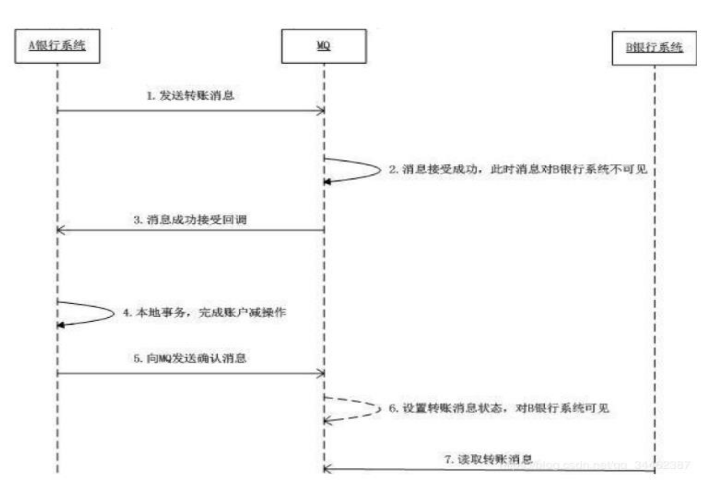

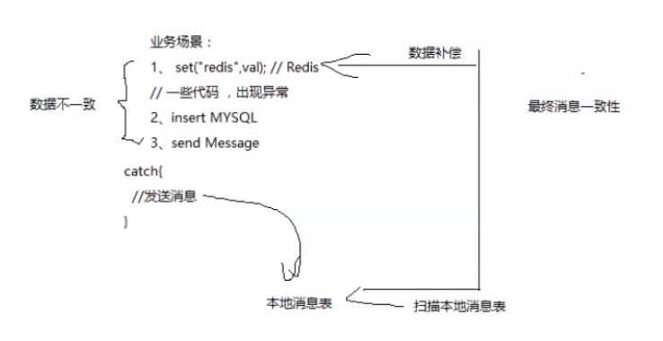

## RocketMQ架构

类似于ES的分片存储结构

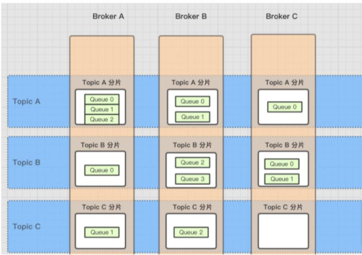

图中都是master主机

1、消费者发送的 Message 会在 Broker 中的 Queue 队列中记录

2、一个 Topic 的数据可能会存在多个 Broker 中 

3、一个 Broker 存在多个 Queue

也就是说每个 Topic 在 Broker 上会划分成几个逻辑队列，每个逻辑队列保存一部分消息数据，但是保存的消息数据实际上不是真正的消息数据，而是指向 commit log 的消息索引

## **消息发送流程**

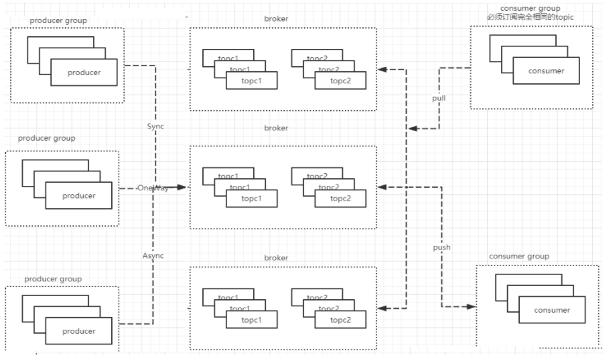

broker中topc是分片的queue

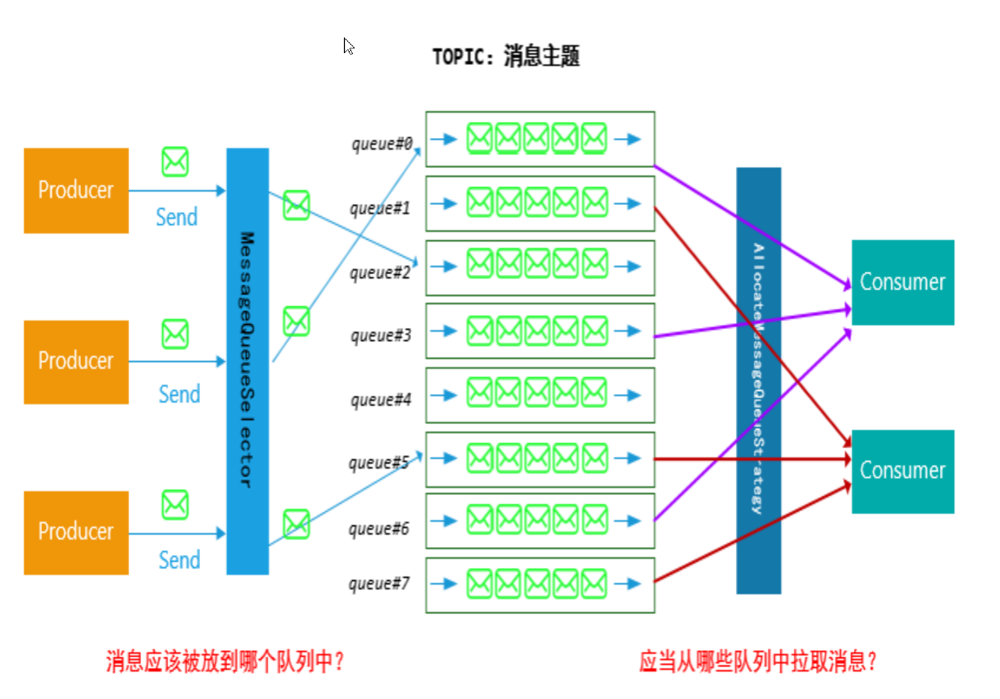

消息发送和拉取是有负载算法的。

发送消息负载均衡算法？

随机递增取模算法

org.apache.rocketmq.client.latency.MQFaultStrategy.selectOneMessageQueue(TopicPublishInfo, String)

随机算法

org.apache.rocketmq.client.producer.selector.SelectMessageQueueByRandom.select(List<MessageQueue>, Message, Object)

hash算法

org.apache.rocketmq.client.producer.selector.SelectMessageQueueByHash.select(List<MessageQueue>, Message, Object)

## **消息消费** 

消费者从master消费，同时又从slave中消费，是否存在重复消费现象？

答案：不会，原因：

1.commitlog ，主从共享，记录消费进度

2.消费负载算法。到底从哪个服务器上获取消费消息。 

### **广播消费** 

一条消息被多个 Consumer 消费，即使这些 Consumer 属于同一个 Consumer Group，消息也会被 ConsumerGroup 中的每个 Consumer 都消费一次

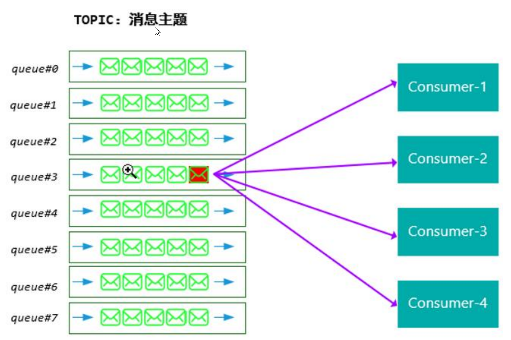

### **集群消费** 

（1）平均分配算法

这里所谓的平均分配算法，并不是指的严格意义上的完全平均，如上面的例子中，10个queue，而消费者只有 4 个，无法是整除关系，除了整除之外的多出来的 queue,将依次根据消费者的顺序均摊

consumer-1:3 个;consumer-2:3 个;consumer-3:2 个;consumer-4:2 个,

（2）环形平均算法

是指根据消费者的顺序，依次在由 queue 队列组成的环形图中逐个分配。具

（3）机房临近法

## **RocketMQ网络架构** 

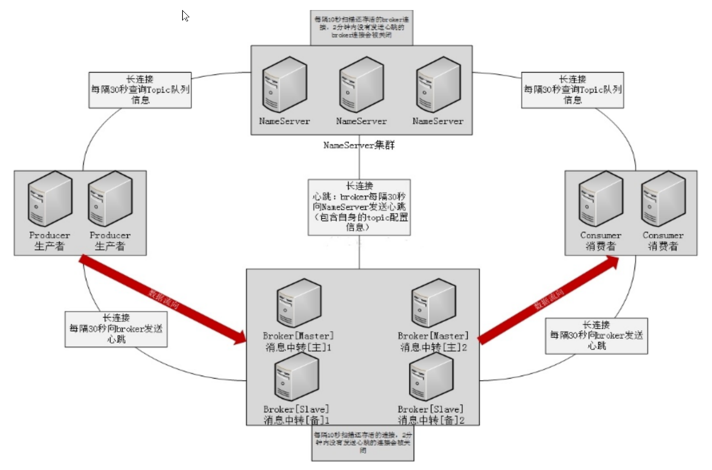

broker每隔30秒向nameserve发送心跳。

comsumer每隔30秒向broker发送心跳。

producer每隔30秒向broker发送心跳。

nameserve每隔10秒nameserve向下扫描broker，这个时间是写死的，若broker2分钟没有响应。那么认为broker已经挂了。

producer每隔30秒访问nameserve查询topic信息

comsumer每隔30秒访问nameserve查询topic信息

客户端负载算法

org.apache.rocketmq.client.impl.factory.MQClientInstance.findBrokerAddressInAdmin(String)

broker的master和slave是共享一个brokername

brokername和brokerId可以确定一个负载

## nameserver 

相对来说，nameserver 的稳定性非常高。原因有二：

1 ）nameserver 互相独立，彼此没有通信关系，单台 nameserver 挂掉，不影响其他

nameserver，即使全部挂掉，也不影响业务系统使用。无状态

2 ）nameserver 不会有频繁的读写，所以性能开销非常小，稳定性很高。

总结：NameServer 是一个几乎无状态的节点，可集群部署，节点之间无任何信息同步

当发出请求服务时,客户端通过注册中心服务知道所有的服务实例。客户端接着使用负载均衡算法选择可用的服务实例中的一个并进行发送。

本地有注册配置信息的缓存。

## **broker**

Broker 就是用来存储消息的服务。Broker 通常都是以集群的方式存在，消息发送者把消息发

送给 broker 进行存储。

Broker 部署相对复杂，Broker 分为 Master 与 Slave，一个 Master 可以对应多个 Slave，但

是一个 Slave 只能对应一个 Master，Master 与 Slave 的对应关系通过指定相同的

BrokerName，不同的 BrokerId 来定义，BrokerId 为 0 表示 Master，非 0 表示 Slave。

Master 也可以部署多个。每个 Broker 与 Name Server 集群中的所有节点建立长连接，定

时注册 Topic 信息到所有 Name Server。

Broker 是 RocketMQ 的核心模块，负责接收并存储消息，同时提供 Push/Pull 接口来将消

息发送给 Consumer。Consumer 可选择从 Master 或者 Slave 读取数据。多个主/从组成 Broker

集群，集群内的 Master 节点之间不做数据交互。Broker 同时提供消息查询的功能，可以通

过 MessageID 和 MessageKey 来查询消息。Borker 会将自己的 Topic 配置信息实时同步到

NameServer。 

## **消费者** 

Consumer 与 Name Server 集群中的其中一个节点（随机选择，但不同于上一次）建立长

连接，定期从 Name Server 取 Topic 路由信息，并向提供 Topic 服务的 Master、Slave 建

立长连接，且定时向 Master、Slave 发送心跳

消息消费者，位于用户进程内。Consumer 通过 NameServer 获取所有 broker 的路由信息后，

向Broker发送Pull请求来获取消息数据。Consumer可以以两种模式启动，广播（Broadcast）

和集群（Cluster）**，**广播模式下，一条消息会发送给所有 Consumer，集群模式下消息只

会发送给一个 Consumer。 

Consumer Group

消费者组，和生产者类似，消费同一类消息的多个 Consumer 实例组成一个消费者组。

## **生产者** 

Producer 与 Name Server 集群中的其中一个节点（随机选择，但不同于上一次）建

立长连接，定期从 Name Server 取 Topic 路由信息，并向提供 Topic 服务的 Master 建立

长连接，且定时向 Master 发送心跳

消息生产者，位于用户的进程内，`Producer 通过 NameServer 获取所有 Broker 的路由信息，根据负载均衡策略选择将消息发到哪个 Broker，然后调用 Broker 接口提交消息。

Producer Group

生产者组，简单来说就是多个发送同一类消息的生产者称之为一个生产者组。

## **Topic**

Topic 是消息中间件里一个重要的概念，每一个 Topic 代表了一类消息，有了多个 Topic，就可以对消息进行归类与隔离

Topic 表示消息的第一级类型，比如一个电商系统的消息可以分为：交易消息、物流消息等。

Topic 用于将消息按主题做划分，Producer 将消息发往指定的 Topic，Consumer 订阅该Topic 就可以收到这条消息。Topic 跟发送方和消费方都没有强关联关系，发送方可以同时往多个 Topic 投放消息，消费方也可以订阅多个 Topic 的消息。在 RocketMQ 中，Topic 是一个上逻辑概念。消息存储不会按 Topic 分开。一条消息必须有一个 Topic。最细粒度的订阅单位，一个 Group 可以订阅多个 Topic 的消息。

## **分区queue**

RocketMQ 是磁盘消息队列的模式，对于同一个消费组，一个分区只支持一个消费线程来

消费消息。过少的分区，会导致消费速度大大落后于消息的生产速度。所以在实际生产环

境中，一个 Topic 会设置成多分区的模式，来支持多个消费者，

为什么搞多个队列？

因为队列每一时刻只能有一个消费者。

Topic 和 Queue 是 1 对多的关系**，**一个 Topic 下可以包含多个 Queue，主要用于负载均衡。发送消息时，用户只指定 Topic，Producer 会根据 Topic 的路由信息选择具体发到哪个 Queue 上。Consumer 订阅消息时，会根据负载均衡策略决定订阅哪些 Queue 的消息。消息的物理管理单位。一个 Topic 下可以有多个 Queue，Queue 的引入使得消息的存储可以分布式集群化，具有了水平扩展能力。

在 RocketMQ 中，所有消息队列都是持久化，长度无限的数据结构，所谓长度无限是指队列中的每个存储单元都是定长，访问其中的存储单元使用 Offset 来访问，offset 为 java long 类型，64 位，理论上在 100 年内不会溢出，所以认为是长度无限。也可以认为 Message Queue 是一个长度无限的数组，Offset 就是下标。

## Message

代表一条消息，使用`MessageId`唯一识别，用户在发送时可以设置 messageKey，便于之后

查询和跟踪。一个 Message 必须指定 Topic，相当于寄信的地址。Message 还有一个可选

的 Tag 设置，以便消费端可以基于 Tag 进行过滤消息。也可以添加额外的键值对，例如你

需要一个业务 key 来查找 Broker 上的消息，方便在开发过程中诊断问题。

消息去重

## Tag

标签可以被认为是对 Topic 进一步细化。一般在相同业务模块中通过引入标签来标记不同

用途的消息。

Tag 表示消息的第二级类型，比如交易消息又可以分为：交易创建消息，交易完成消息等。

RocketMQ 提供 2 级消息分类，方便灵活控制。

## Offset

RocketMQ 在存储消息时会为每个 Topic 下的每个 Queue 生成一个消息的索引文件，每个

Queue 都对应一个 Offset记录当前 Queue 中消息条数

## CommitLog

记录消息位置，方便快速找到消息

## RocketMQ文件存储模型

RocketMQ文件存储模型层次结构如上图所示，根据类别和作用从概念模型上大致可以划分为5层

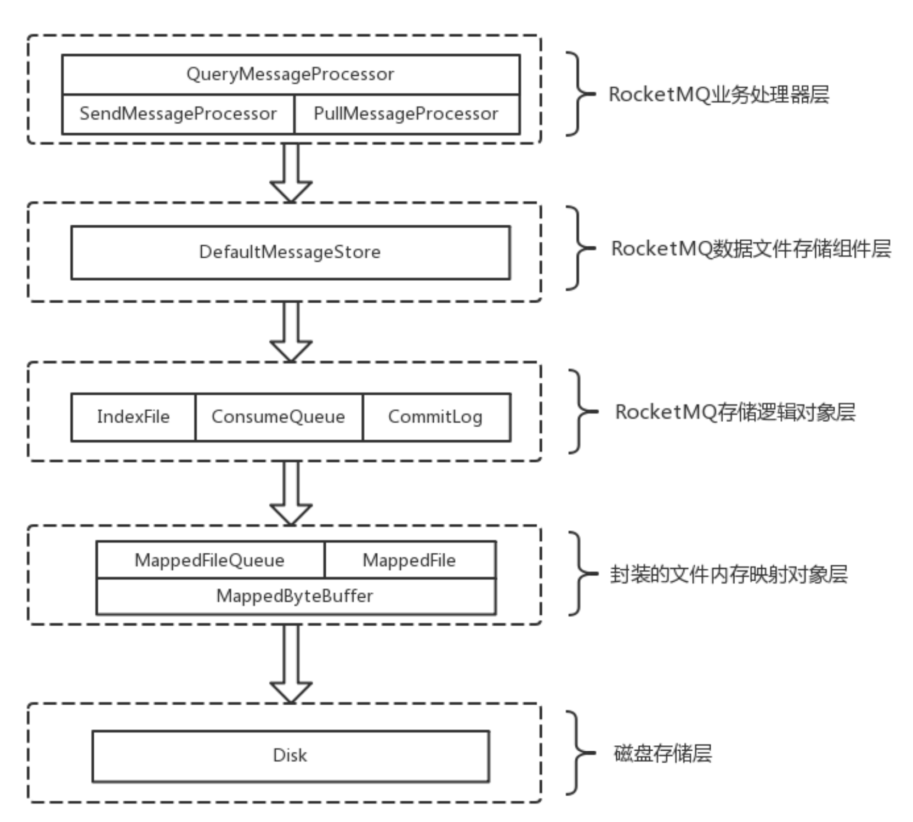

## **存储流程**

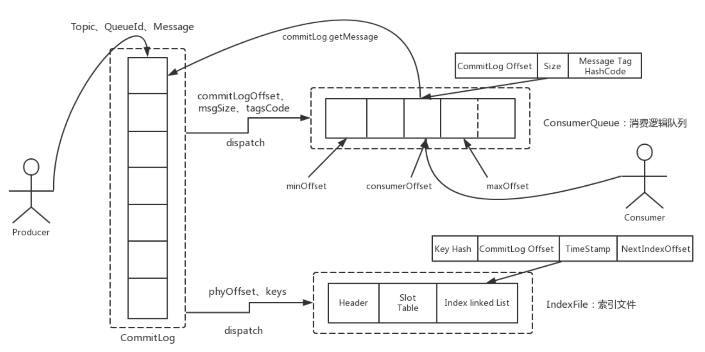

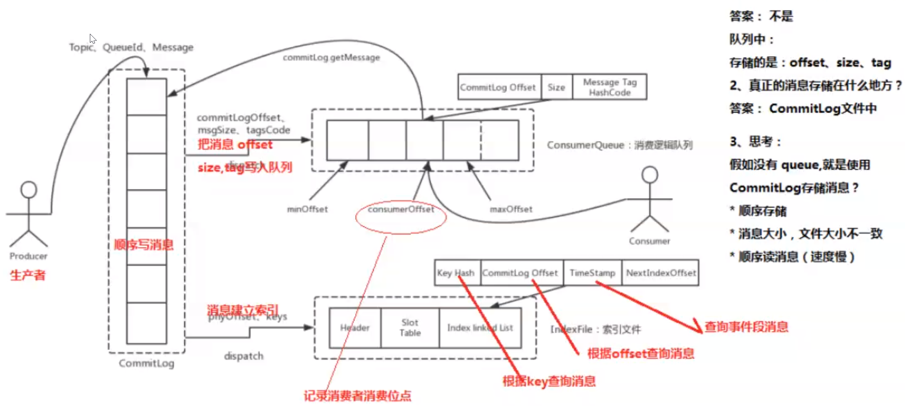

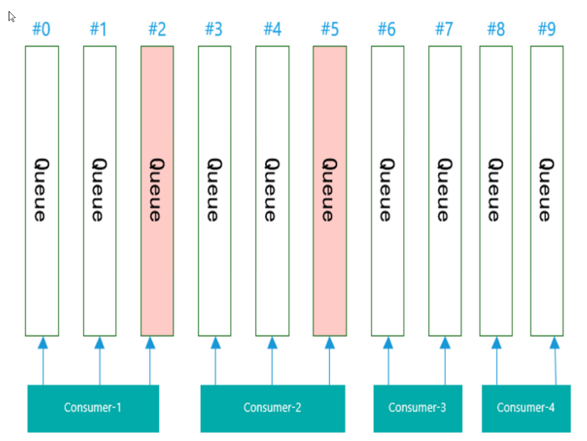

一个broker(Master和Slave)共享一个commitlog，一个queue消费完了才会重新计算负载。

每个队列含有相同消息的queue。一个消费者只能对应一个queue。

## **顺序消息**

顺序消息（FIFO 消息）是 MQ 提供的一种严格按照顺序进行发布和消费的消息类型。顺序消息由两个

部分组成：顺序发布和顺序消费。

顺序消息包含两种类型：

分区顺序：一个Partition内所有的消息按照先进先出的顺序进行发布和消费 

全局顺序：一个Topic内所有的消息按照先进先出的顺序进行发布和消费 

在某些业务中，consumer在消费消息时，是需要按照生产者发送消息的顺序进行消费的，比如在电商

系统中，订单的消息，会有创建订单、订单支付、订单完成，如果消息的顺序发生改变，那么这样的消

息就没有意义了。

多线程中若没有因果关系则没有顺序。那么用户在多线程中去发消息就意味着用户不关心那些在不同线程中被发送的消息的顺序。即多线程发送的消息，不同线程间的消息不是顺序发布的，同一线程的消息是顺序发布的。这是需要用户自己去保障的

而对于顺序消费，则需要保证哪些来自同一个发送线程的消息在消费时是按照相同的顺序被处理的

**如何保证顺序**

在MQ的模型中，顺序需要由3个阶段去保障：

\1. 消息被发送时保持顺序

分区顺序：一个Partition内所有的消息按照先进先出的顺序进行发布和消费 

全局顺序：一个Topic内所有的消息按照先进先出的顺序进行发布和消费 

1

2

\32. 消息被存储时保持和发送的顺序一致

\3. 消息被消费时保持和存储的顺序一致

发送时保持顺序意味着对于有顺序要求的消息，用户应该在同一个线程中采用同步的方式发送。存储保

持和发送的顺序一致则要求在同一线程中被发送出来的消息A和B，存储时在空间上A一定在B之前。而

消费保持和存储一致则要求消息A、B到达Consumer之后必须按照先A后B的顺序被处理。

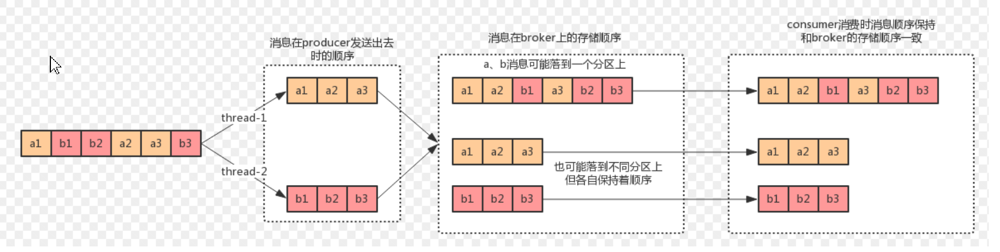

对于两个订单的消息的原始数据：a1、b1、b2、a2、a3、b3（绝对时间下发生的顺序）：

在发送时，a订单的消息需要保持a1、a2、a3的顺序，b订单的消息也相同，但是a、b订单之间的

消息没有顺序关系，这意味着a、b订单的消息可以在不同的线程中被发送出去

在存储时，需要分别保证a、b订单的消息的顺序，但是a、b订单之间的消息的顺序可以不保证

a1、b1、b2、a2、a3、b3是可以接受的

a1、a2、b1、b2、a3、b3也是可以接受的

a1、a3、b1、b2、a2、b3是不能接受的

消费时保证顺序的简单方式就是“什么都不做”，不对收到的消息的顺序进行调整，即只要一个分区

的消息只由一个线程处理即可；当然，如果a、b在一个分区中，在收到消息后也可以将他们拆分

到不同线程中处理，不过要权衡一下收益

**消息去重**

造成消息重复的根本原因是：网络不可达。只要通过网络交换数据，就无法避免这个问题。所以解决这

个问题的办 法就是绕过这个问题。那么问题就变成了：如果消费端收到两条一样的消息，应该怎样处

理？

第1条很好理解，只要保持幂等性，不管来多少条重复消息，最后处理的结果都一样。

第2条原理就是利用一张日志表来记录已经处理成功的消息的ID，如果新到的消息ID已经在日志表中，

那么就不再处理这条消息。

第1条解决方案，很明显应该在消费端实现，不属于消息系统要实现的功能。

第2条可以消息系统实现，也可以业务端实现。正常情况下出现重复消息的概率其实很小，如果由消息

系统来实现的话，肯定会对消息系统的吞吐量和高可用有影响，所以最好还是由业务端自己处理消息重

复的问题，这也是RocketMQ不解决消息重复的问题的原因。 RocketMQ不保证消息不重复，如果你的

业务需要保证严格的不重复消息，需要你自己在业务端去重

