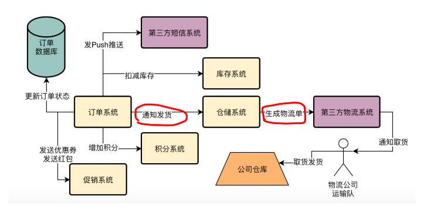
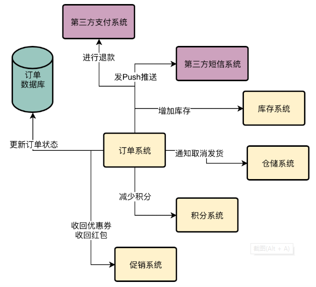
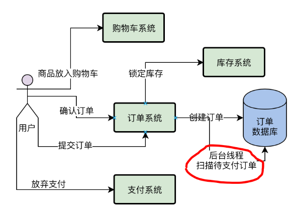
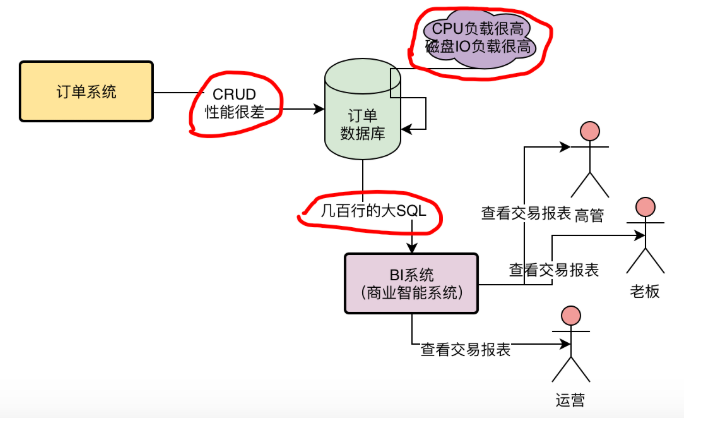
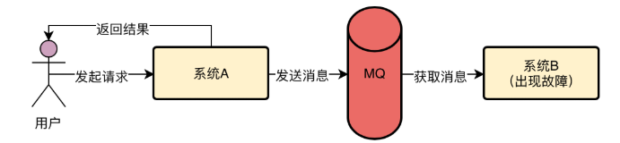
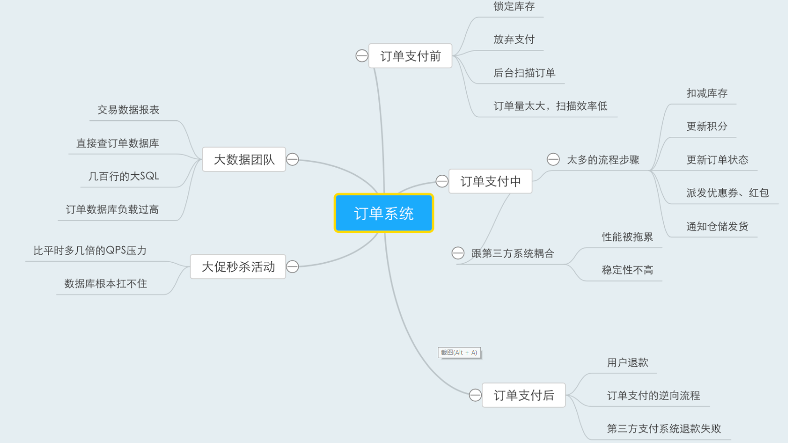

## MQ功能

异步提升性能，降低系统耦合，流量消峰。

## MQ应用场景

1.核心业务流程

2.后台线程定时补偿机制

3.第三方系统耦合

4.核心链路调用失败

5.其他系统获取数据

6.流量洪峰

## 实际场景举例

### 系统面临的现实问题：下订单的同时还要发券、发红包、Push推送，性能太差！

当系统压力越来越大的时候，会出现什么问题？

在上面8个步骤中，全部执行完毕，要1秒到2秒的时间，在高峰期要达到好几秒的时间。对用户的体验不太好。

### 系统面临的现实问题：第三方客户系统的对接耦合性太高，经常出问题！

跟第三系统耦合，性能差，不稳定，

### 系统面临的现实问题：订单退款时经常流程失败，无法完成退款！

订单退款的时候是一个逆向过程，

退款和支付一样，流程过长，导致用户体验太差。

退款的最大问题在于，第三方支付系统退款失败怎么处理？

用户下单后，不付款怎么处理？

如果发现超过24个小时不付款，就直接把订单设置为已关闭，释放锁定后的库存。

如果几十万个订单不付款，难道要一直扫描么？

### 系统面临的现实问题：大数据团队需要订单数据，该怎么办？

大数据团队需要查询订单系统，导致订单系统性能下降，如何解决?

### 系统面临的现实问题：秒杀活动时数据库压力太大，该怎么缓解？

如果用户每秒发起2000 个请求到我们的订单系统的各类接口，包括下单接口，退款接口，查询接口，那么订单系统每秒会执行多少条SQL在订单数据库上？

一般根据经验可以认为平均每个接口会执行2~3次的数据库操作

所以结合线上数据库的可视监控界面，基本可以知道，平均每次订单系统的接口调用，会执行2次数据库操作。

假设我们采用的是高配置的16核32G以及SSD固态硬盘机器。因此观察线上数据库的情况，每秒4000请求的时候，CPU,磁盘，IO等负载较高，基本在承受范围。

秒杀活动会导致系统每秒几千的请求，数据库也会成倍增加。甚至都会**上万QPS**的请求。

## 场景解决办法

订单系统仅仅会同步执行更新订单状态和扣减库存两个最关键的操作，因为一旦你支付成功，只要保证订单状态变为“已支付”，库存扣减掉，就可以保证核心数据不错乱。诸如增加积分、发送优惠券、发送短信、通知发货的操作，都可以通过MQ实现异步化执行。

MySQL Binlog系统现在是有不少成熟的开源技术方案的，比如阿里开源的Canal，以及Linkedin开源的Databus，都可以监听MySQL Binlog，然后将MySQL Binlog发送给你的系统，交给你去处理。

将完整的订单数据库的MySQL Binlog推送到RocketMQ里

CDN + Nginx + Redis的多级缓存架构

CDN缓存就是我们多级缓存架构里的第一级缓存

Nginx中是可以基于Lua脚本实现本地缓存的，我们可以提前把秒杀商品详情页的数据放到Nginx中进行缓存，如果请求发送过来，可以从Nginx中直接加载缓存数据，不需要把请求转发到我们商品系统上去

Nginx中的Lua脚本发送请求到Redis集群中去加载我们提前放进去的秒杀商品数据

分布在全国各地的用户的大量请求都是分散发送给各个地方的CDN的，所以CDN就分摊掉了大量的请求。而即使请求到达了我们的后台系统，都是由轻松单机抗10万+并发的Nginx和Redis来返回商品数据的。

你点击按钮之后先进行答题，就是说先弹出来一个框

一般我们会对订单系统部署两个集群，一个集群是秒杀订单系统集群，一个集群是普通订单系统集群

每个秒杀商品的库存提前写入Redis中，然后当请求到来之后，就直接对Redis中的库存进行扣减，Redis是可以轻松用单机抗每秒几万高并发的，因此这里就可以抗下高并发的库存扣减。

Redis中的库存被扣减完之后，就说明后续其他的请求都没有必要发送到秒杀系统中了，因为商品已经被抢购完毕了，此时我们可以让Nginx在接收到后续请求的时候，直接就把后续请求过滤掉。一旦商品抢购完毕，可以在ZooKeeper中写入一个秒杀完毕的标志位，然后ZK会反向通知Nginx中我们自己写的Lua脚本，通过Lua脚本后续在请求过来的时候直接过滤掉，不要向后转发了。

1万件商品同时被1万人秒杀成功了，那么可能瞬间会有1万请求涌入正常的订单系统进行后续的处理，此时可能还是会有瞬间上万请求访问到订单数据库中创建订单。这个时候，完全可以引入RocketMQ进行削峰处理。

利用RocketMQ抗下每秒几万并发的下单请求，然后让订单系统以每秒几千的速率慢慢处理就可以了，也就是延迟个可能几十秒，这些下单请求就会处理完毕。

## 高并发订单系统面临的技术痛点总结

