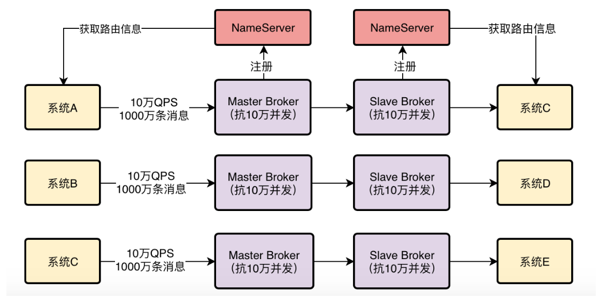
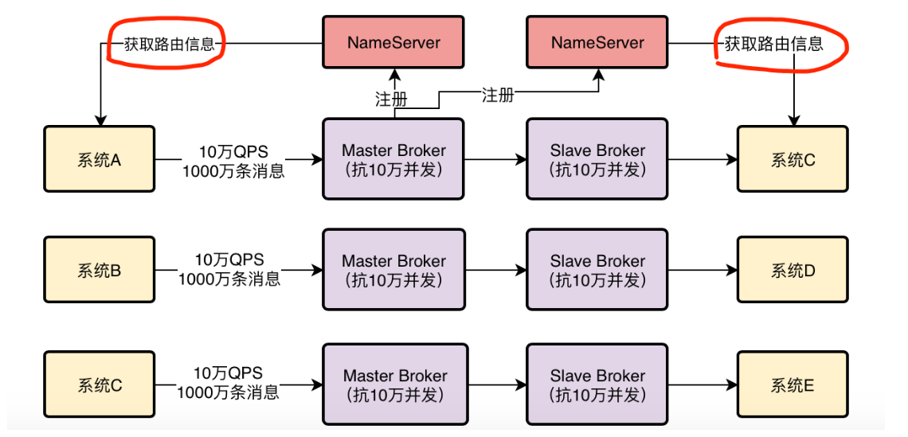
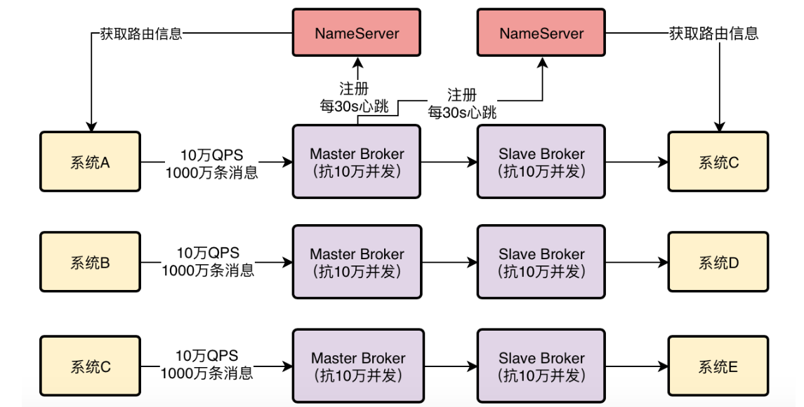
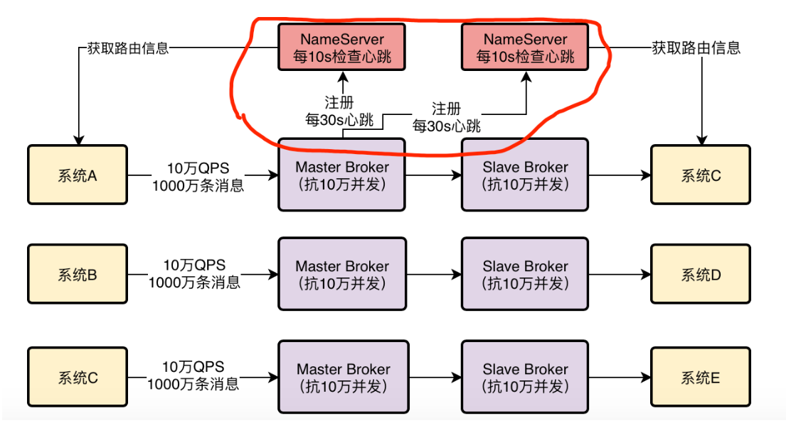
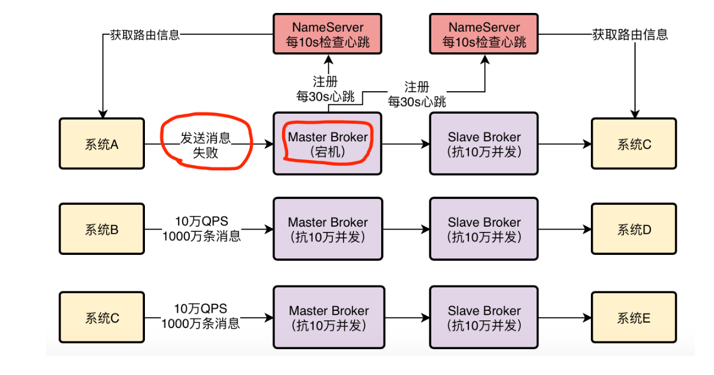

**第一块**就是他的NameServer，这个东西很重要，他要负责去管理集群里所有Broker的信息，让使用MQ的系统可以通过他感知到集群里有哪些Broker。

**第二块**就是Broker集群本身了，必须得在多台机器上部署这么一个集群，而且还得用主从架构实现数据多副本存储和高可用。

**第三块**就是向MQ发送消息的那些系统了，这些系统一般称之为生产者，这里也有很多细节是值得深究的，因为这些生产者到底是如何从NameServer拉取路由信息的？如何选择Broker机器建立连接以及发送消息的？

**第四块**就是从MQ获取消息的那些系统，这些系统一般称之为消费者。

## RocketMQ NameServer设计原理

 NameServer，首先是支持部署多台机器的。也就是说，NameServer是可以集群化部署的 ，保证 **高可用性**。 

 Broker在启动的时候是把自己的信息注册到哪个NameServer上去的 

 比如一共有10台Broker机器，2个NameServer机器，然后其中5台Broker会把自己的信息注册到1个NameServer上去，另外5台Broker会把自己的信息注册到另外1个NameServer上去。 那么到底是不是这样呢？

答案是：**不对**

这样搞有一个最大的问题，如果1台NameServer上有5个Broker的信息，另外1个NameServer上有另外5个Broker的信息，那么此时任何一个NameServer宕机了，不就导致5个Broker的信息就没了吗？

所以这种做法是不靠谱的，会导致数据丢失，系统不可用。

因此正确答案是：每个Broker启动都得向所有的NameServer进行注册

 在这个图里就示范了一个Master Broker得向两台NameServer都进行注册的情况，这才是真正的情况。 

## 系统如何从NameServer获取Broker信息

 他们需要知道集群里有哪些Broker，才能根据一定的算法挑选一个Broker去发送消息或者获取消息。 

有两种办法：

第一种办法是这样，NameServer那儿会主动发送请求给所有的系统，告诉他们Broker信息。

这种办法靠谱吗？明显不靠谱，因为NameServer怎么知道要推送Broker信息给哪些系统？未卜先知吗？

第二种办法是这样的，每个系统自己每隔一段时间，定时发送请求到NameServer去拉取最新的集群Broker信息。

这个办法是靠谱的，没有什么明显的缺陷，所以RocketMQ中的生产者和消费者就是这样，**自己主动去NameServer拉取Broker信息的**。

顺便在这里解释一下，图里的路由信息，大致可以理解为集群里的Broker信息以及其他相关的数据信息

通过这些路由信息，每个系统就知道发送消息或者获取消息去哪台Broker上去进行了，这起到一个把消息路由到一个Broker上的效果，所以一般我们把这种信息叫做路由信息。

##  **如果Broker挂了，NameServer是怎么感知到的？** 

在一个Broker启动之后向NameServer注册了，每个NameServer都知道集群里有这么一台Broker的存在了，然后各个系统从NameServer那儿也拉取到了Broker信息，也知道集群里有这么一台Broker

但是如果之后这台Broker挂了呢？

要解决这个问题，靠的是Broker跟NameServer之间的心跳机制，Broker会每隔30s给所有的NameServer发送心跳，告诉每个NameServer自己目前还活着。

每次NameServer收到一个Broker的心跳，就可以更新一下他的最近一次心跳的时间

然后NameServer会每隔10s运行一个任务，去检查一下各个Broker的最近一次心跳时间，如果某个Broker超过120s都没发送心跳了，那么就认为这个Broker已经挂掉了。

## Broker挂了，系统是怎么感知到的？

下一个问题，如果Broker挂掉了，那么作为生产者和消费者的系统是怎么感知到的呢？难道必须得NameServer发送请求给所有的系统通知他们吗？

这个是不现实的，之前已经说过了，NameServer去发送这个东西非常的不靠谱。

但是如果NameServer没有及时通知给那些系统，那么有没有可能出现这样一种情况，刚开始集群里有10个Broker，各个系统从NameServer那里得知，都以为有10个Broker。

结果此时突然挂了一个Broker，120s没发心跳给NameServer，NameServer是知道现在只有9个Broker了。

但是此时其他系统是不知道只有9个Broker的，还以为有10个Broker，此时可能某个系统就会发送消息到那个已经挂掉的Broker上去，此时是绝对不可能成功发送消息的

 针对这个情况怎么办？这个问题要我们以后去分析生产者原理的时候才会具体说他的细节，现在简单先提一下思路。 

首先，你可以考虑不发送消息到那台Broker，改成发到其他Broker上去。

其次，假设你必须要发送消息给那台Broker，那么他挂了，他的Slave机器是一个备份可以继续使用，你是不是可以考虑等一会儿去跟他的Slave进行通信？

对Kafka、RabbitMQ、RocketMQ的架构原理都有了一个认知之后，就会发现，不同的MQ技术总得有一个**路由中心**的角色。

这个路由中心的角色需要去感知集群里所有的Broker节点，然后需要去配合生产者和消费者，让人家都能感知到集群里有哪些Broker，才能让各个系统跟MQ进行通信。

如果大家之前都对Kafka和RabbitMQ自行查阅资料有了一个基本的了解之后，就会发现Kafka的路由中心实际上是一个非常复杂、混乱的存在。他是由ZooKeeper以及某个作为Controller的Broker共同完成的。

RabbitMQ的话自己本身就是由集群每个节点同时扮演了路由中心的角色。

而RocketMQ是把路由中心抽离出来作为一个独立的NameServer角色运行的，因此可以说在路由中心这块，他的架构设计是最清晰明了的。