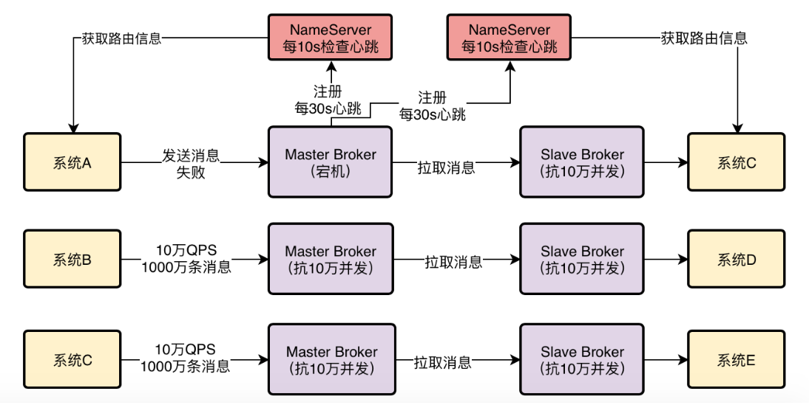
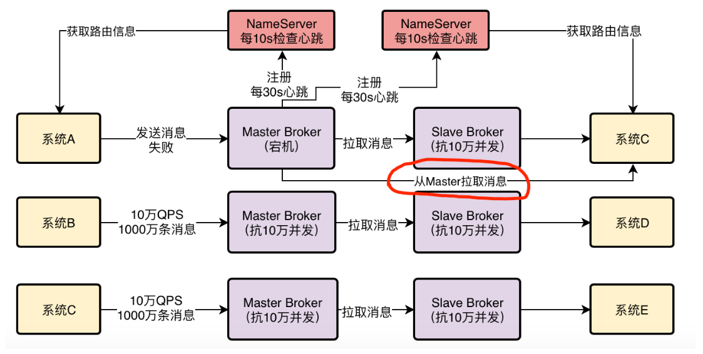
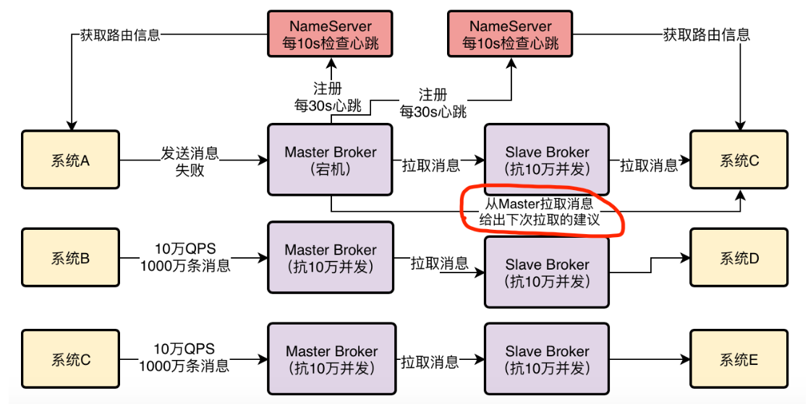
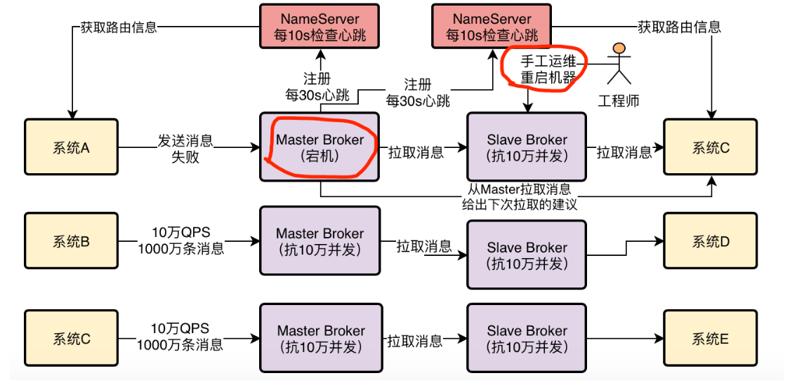
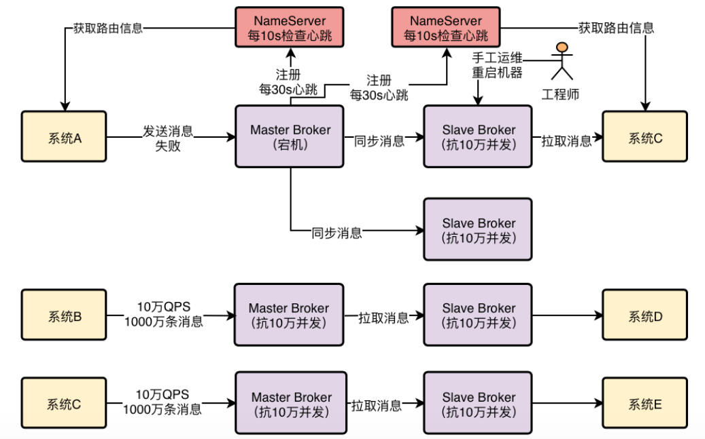
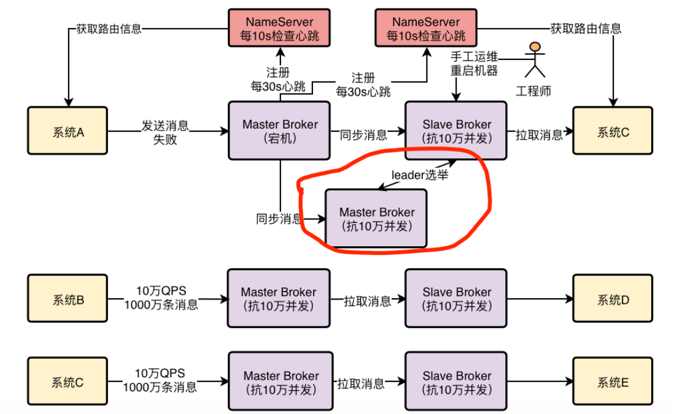

## Master Broker是如何将消息同步给Slave Broker的？

 为了保证MQ的数据不丢失而且具备一定的高可用性，所以一般都是得将Broker部署成Master-Slave模式的，也就是一个Master Broker对应一个Slave Broker 

 然后Master需要在接收到消息之后，将数据同步给Slave，这样一旦Master Broker挂了，还有Slave上有一份数据。 

**说明**：

- Slave Broker也会向所有的NameServer进行注册，图中没有画出！
- Slave Broker也会向所有的NameServer每30s发送心跳，图中没有画出！

我们先考虑一个问题，Master Broker是如何将消息同步给Slave Broker的？是Master Broker主动推送给Slave Broker？还是Slave Broker发送请求到Master Broker去拉取？

**答案是第二种**，RocketMQ的Master-Slave模式采取的是Slave Broker不停的发送请求到Master Broker去拉取消息。

 所以首先要明白这一点，就是RocketMQ自身的Master-Slave模式采取的是**Pull模式**拉取消息。 

## RocketMQ 实现读写分离了吗

既然Master Broker主要是接收系统的消息写入，然后会同步给Slave Broker，那么其实本质上Slave Broker也应该有一份一样的数据。 

所以这里提出一个疑问，作为消费者的系统在获取消息的时候，是从Master Broker获取的？还是从Slave Broker获取的？

其实都不是。答案是：**有可能从Master Broker获取消息，也有可能从Slave Broker获取消息**

作为消费者的系统在获取消息的时候会先发送请求到Master Broker上去，请求获取一批消息，此时Master Broker是会返回一批消息给消费者系统的 

 然后Master Broker在返回消息给消费者系统的时候，会根据当时Master Broker的负载情况和Slave Broker的同步情况，向消费者系统建议下一次拉取消息的时候是从Master Broker拉取还是从Slave Broker拉取。 

要是这个时候Master Broker负载很重，本身要抗10万写并发了，你还要从他这里拉取消息，给他加重负担，那肯定是不合适的。

所以此时Master Broker就会建议你从Slave Broker去拉取消息。

或者举另外一个例子，本身这个时候Master Broker上都已经写入了100万条数据了，结果Slave Broke不知道啥原因，同步的特别慢，才同步了96万条数据，落后了整整4万条消息的同步，这个时候你作为消费者系统可能都获取到96万条数据了，那么下次还是只能从Master Broker去拉取消息。

因为Slave Broker同步太慢了，导致你没法从他那里获取更新的消息了。

 所以这一切都会由Master Broker根据情况来决定，小猛说着打开了一个图，里面有示意。 

所以在写入消息的时候，通常来说肯定是选择Master Broker去写入的

但是在拉取消息的时候，有可能从Master Broker获取，也可能从Slave Broker去获取，一切都根据当时的情况来定。

**如果Slave Broke挂掉了有什么影响？**

下一个问题：如果Slave Broker挂掉了，会对整个系统有影响吗？

答案是：**有一点影响，但是影响不太大**

因为消息写入全部是发送到Master Broker的，然后消息获取也可以走Master Broker，只不过有一些消息获取可能是从Slave Broker去走的。

所以如果Slave Broker挂了，那么此时无论消息写入还是消息拉取，还是可以继续从Master Broke去走，对整体运行不影响。

只不过少了Slave Broker，会导致所有读写压力都集中在Master Broker上。

**5、如果Master Broker挂掉了该怎么办？**

现在假设出现了一个故障，Master Broker突然挂了，这样会怎么样？

这个时候就对消息的写入和获取都有一定的影响了。但是其实本质上而言，Slave Broker也是跟Master Broker一样有一份数据在的，只不过Slave Broker上的数据可能有部分没来得及从Master Broker同步。

但是此时RocketMQ可以实现直接自动将Slave Broker切换为Master Broker吗？

 答案是：**不能** 

在RocketMQ 4.5版本之前，都是用Slave Broker同步数据，尽量保证数据不丢失，但是一旦Master故障了，Slave是没法自动切换成Master的。

所以在这种情况下，如果Master Broker宕机了，这时就得手动做一些运维操作，把Slave Broker重新修改一些配置，重启机器给调整为Master Broker，这是有点麻烦的，而且会导致中间一段时间不可用。

 所以这种Master-Slave模式 不是彻底的高可用模式，他没法实现自动把Slave切换为Master

**6、基于Dledger实现RocketMQ高可用自动切换**

在RocketMQ 4.5之后，这种情况得到了改变，因为RocketMQ支持了一种新的机制，叫做Dledger

本身这个东西是基于Raft协议实现的一个机制 

讲讲基于Dledger可以实现RocketMQ的高可用自动切换的效果。

简单来说，把Dledger融入RocketMQ之后，就可以让一个Master Broker对应多个Slave Broker，也就是说一份数据可以有多份副本，比如一个Master Broker对应两个Slave Broker。

 然后依然会在Master和Slave之间进行数据同步 

 此时一旦Master Broker宕机了，就可以在多个副本，也就是多个Slave中，通过Dledger技术和Raft协议算法进行leader选举，直接将一个Slave Broker选举为新的Master Broker，然后这个新的Master Broker就可以对外提供服务了。 

 整个过程也许只要10秒或者几十秒的时间就可以完成，这样的话，就可以实现Master Broker挂掉之后，自动从多个Slave Broker中选举出来一个新的Master Broker，继续对外服务，一切都是自动的。 

 设计RocketMQ生产部署架构的时候，完全可以采用基于Dledger的部署方式，这样可以让RocketMQ做到自动故障切换了！ 