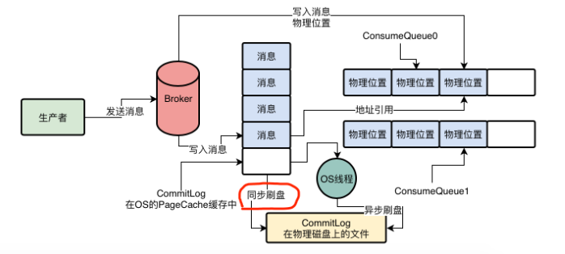

## MessageQueue

MessageQueue是一个数据分片的机制

有的MessageQueue的数据多，有的数据少，这个要根据你的消息写入MessageQueue的策略来定。

通过MessageQueue将一个Topic的数据拆分为了很多个数据分片，然后在每个Broker机器上都存储一些MessageQueue。

生产者从NameServer中就会知道，一个Topic有几个MessageQueue，哪些MessageQueue在哪台Broker机器上，哪些MesssageQueue在另外一台Broker机器上。

让一个Topic中的数据分散在多个MessageQueue中，进而分散在多个Broker机器上

Producer中开启一个开关  sendLatencyFaultEnable

 一旦打开了这个开关，那么他会有一个自动容错机制，比如如果某次访问一个Broker发现网络延迟有500ms，然后还无法访问，那么就会自动回避访问这个Broker一段时间，比如接下来3000ms内，就不会访问这个Broker了。

避免一个Broker故障之后，短时间内生产者频繁的发送消息到这个故障的Broker上去，出现较多次数的异常。而是在一个Broker故障之后，自动回避一段时间不要访问这个Broker，过段时间再去访问他。

## Commitlog

生产者的消息发送到Broker时，broker会把这个消息直接顺序写入一个日志文件，叫做commitlog

commitlog是很多磁盘文件，每个文件限定是1GB，Broker收到消息之后就直接追加写入这个文件的末尾，如果Commitlog写满1GB，就会创建一个新的Commitlog文件

## ConsumeQueue

Broker的磁盘上，会有以下格式文件

$HOME/store/consumequeue/{topic}/{messageQueueId}/{fileName}

在broker中，对topic下的每个MessageQueue都会有一系列的ConsumeQueue文件，messageQueueId就是指代某个MessageQueue。MessageQueue会有很多的ConsumeQueue文件，这个ConsumeQueue文件里存储的是一条消息对应在CommitLog文件中的偏移量offset

在ConsumeQueue中存的每条数据不只是消息在CommitLog中的offset偏移量，还包含消息的长度，以及taghashcode，一条数据是20个字节，每个ConsumeQueue文件保存30万条数据，大概5.72MB

所以实际上topic的每个messageQueue都对应了Broker机器上的多个ConsumeQueue文件，保存了MessageQueue所有消息在CommitLog文件中的物理位置offset。

broker通过PageCache和顺序写两个机制，来提升CommitLog文件的性能

数据写入CommitLog文件的时候，其实不是直接写入底层的物理磁盘文件，而是先进入OS的PageCache内存缓存中，然后后续由OS的后台线程选一个时间，异步化的将OSPageCache内存缓冲中的数据刷入磁盘文件

## 同步刷盘和异步刷盘

在上述的异步刷盘模式下，生产者把消息发送给Broker，Broker将消息写入OS PageCache中，就直接返回ACK给生产者了。生产者就认为写入成功，这就是异步刷盘

异步刷盘的策略下，可以让消息吞吐量非常高，但是会有丢失数据的风险。

同步刷盘，生产者发送消息以后，broker必须强制将这个消息刷入底层磁盘文件，才会返回ack给producer，告诉你写入成功。

同步刷盘的策略下，会让消息吞吐量急剧下降

