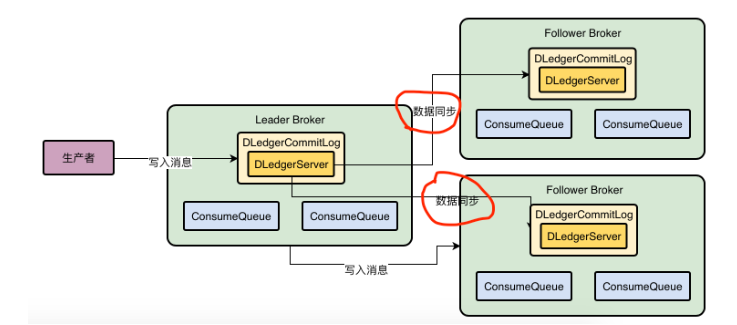

DLedger有自己的CommitLog机制，当接受数据后，会自己写入CommitLog磁盘文件中去。使用Dledger来管理CommitLog， 然后Broker还是可以基于DLedger管理的CommitLog去构建Broker机器上的各个ConsumeQueue磁盘文件

使用DLedger替换各个broker上的CommitLog管理组件，每个broker上都有一个DLedger组件

Dledger是基于Raft协议来进行LeaderBroker选举的。他们都会投票给自己作为Leader，然后把这个投票发送给其他Broker。

第一轮投票结束后，接着随机时间的休眠，先醒过来的继续尝试投票给自己，并且发送选票给别人。

后醒来的因为自己还没投票，会受到别人的投票结果，会把自己的投票结果发送给被人。

最后醒来也会因为自己还没投票，受到其他2个人的投票结果，选择别人的投票结果发送个别人。

其实只要有3台机器/2 +1 个人投票给某个人，就会选举他当Leader。这个机器数量/2+1 就是大多数的意思

Raft协议的多副本同步机制，也就是说DLedger接到消息后是如何基于Raft协议进行多副本同步的？

数据同步会分为两个阶段，一个是uncommitted阶段，一个是commited阶段

LeaderBroker上Dledger收到一条数据之后，会标记uncommitted状态，然后他会通过自己的DLedgerServer组件把这个uncommitted的数据发送给follower的DledgerServer

接着Follwer Broker的DLedgerServer收到Uncommitted消息之后，必须返回一个ack给Leader Broker的DLegerServer，然后如果LeaderBroker收到半数的FollowBroker返回ack之后，就会将消息标记为committed状态

然后LeaderBroker上的DLedgerServer就会发送Commited消息给FollowerBroker机器的DLedgerServer,让他们也把消息标记为commited状态。

Raft协议实现的两阶段完成的数据同步机制

如果LeaderBroker崩了，剩下的FollowerBroler会重新发起选举，他们会基于DLedger采用Raft算法，去选举出来一个新的LeaderBroker继续对外提供服务，而且会对没有完成的数据同步进行一些恢复性的操作，保证数据不丢失，新选举出来的Leader会把数据通过DLedge同步给剩下的Follower Broker

