## 电商下单业务流程

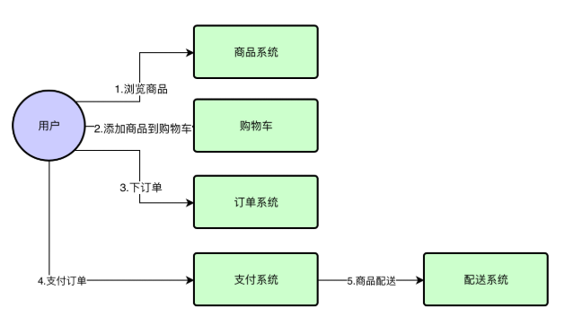

## 订单核心业务流程

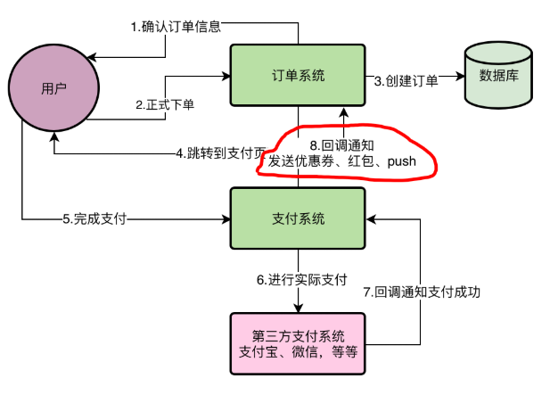

## 订单非核心业务流程

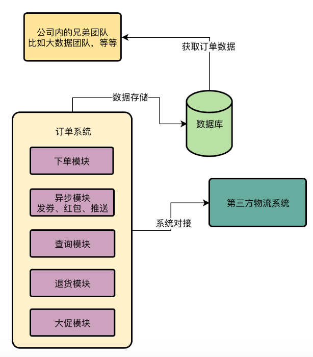

## 真实系统负荷

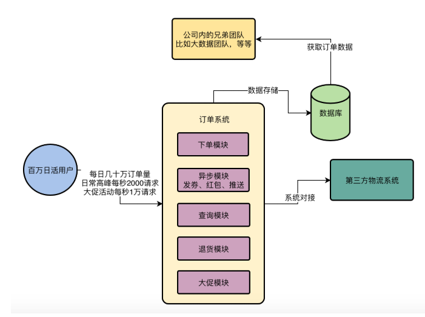

订单系统的整体压力：

一方面是订单系统日益增长的数据量

一方面在大促活动时每秒上万的访问压力

一个千万注册用户的APP，百万日活，每日几十万订单量，每天高峰期访问每秒两三千的QPS，大致负载情况如下：

往常每天高峰期：大概最多会达到每秒2000左右的访问量，

如果是 特价商品显示秒杀的活动，那可能是每秒1W的访问压力。

双11，618大促，订单单日百万订单的量级，对系统压力还是比较大的。

基本上80%的用户都习惯在晚上6点过后到凌晨11点这几个小时使用，在这几个小时内，可以认为有80万左右的用户会使用APP。

一个电商APP，需要用户大量的浏览商品，搜索商品，然后才会下订单和支付订单，所以用户一般会对APP的界面执行几十次或者上百次的点击。那如果每天大概是三五十万个订单，那么就对应百万次下单操作和一些订单查询，

看着百万次系统请求，如果均摊到5个小时，每秒钟也就几十个请求，这么计算是错误的，因为真实的系统访问负载应该是一个半圆形曲线，从晚上6点开始访问量增加，一直到可能晚上八九点到达一个顶点，访问量是最大的。然后慢慢的开始下落，到达11点就变很低。

所以看系统的访问压力的时候，是不能按平均值来计算的。

晚上购物最活跃的时候，订单系统下单最顶点的高峰时段每秒会有超过2000的请求。这就是订单系统的最高负载。

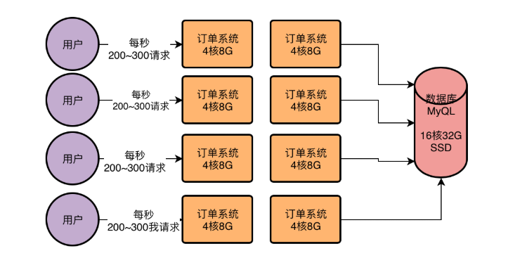

现在线上这样的一个机器部署情况，在高峰期每秒2000以上的请求下是很轻松可以抗住的。

因为4核8G的机器一般每秒钟抗几百请求都没问题，现在才每秒两三百请求，CPU资源使用率都不超过50%

可以说8台4核8G的机器，每台机器每秒高峰期两三百请求是很轻松的。

数据库服务器因为用的是16核32G的配置，因此之前压测的时候知道它既是每秒上万请求也能做到，只不过那个已经是数据库的极限了，会导致数据库服务器的CPU，磁盘，网络，IO，内存的使用率几乎达到了极限

但是一般来说在每秒四五千的请求的话，这样的数据库服务器是没什么问题的，何况经过线上监控统计，现在数据库服务器在高峰期的每秒请求量也就是三四千的样子。

## 系统面临的现实问题：下订单的同时还要发券、发红包、Push推送，性能太差！

当系统压力越来越大的时候，会出现什么问题？

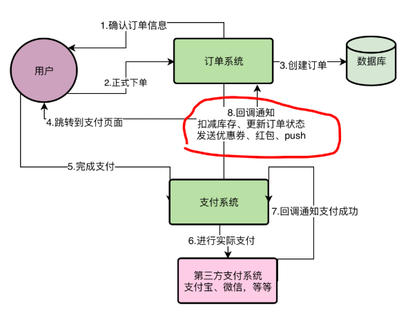

在上面8个步骤中，全部执行完毕，要1秒到2秒的时间，在高峰期要达到好几秒的时间。对用户的体验不太好。

## 系统面临的现实问题：第三方客户系统的对接耦合性太高，经常出问题！

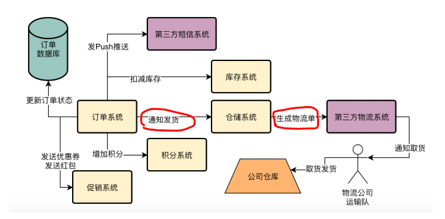

跟第三系统耦合，性能差，不稳定，

## 系统面临的现实问题：订单退款时经常流程失败，无法完成退款！

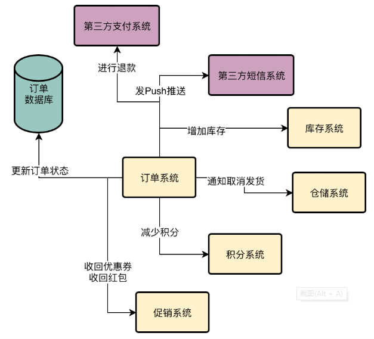

订单退款的时候是一个逆向过程，

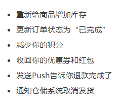

退款和支付一样，流程过长，导致用户体验太差。

退款的最大问题在于，第三方支付系统退款失败怎么处理？

用户下单后，不付款怎么处理？

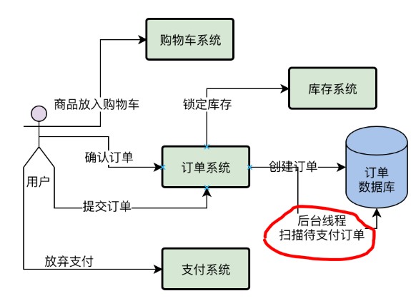

如果发现超过24个小时不付款，就直接把订单设置为已关闭，释放锁定后的库存。

如果几十万个订单不付款，难道要一直扫描么？

## 系统面临的现实问题：大数据团队需要订单数据，该怎么办？

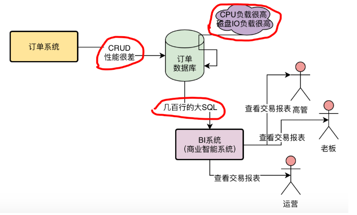

大数据团队需要查询订单系统，导致订单系统性能下降，如何解决?

## 系统面临的现实问题：秒杀活动时数据库压力太大，该怎么缓解？

如果用户每秒发起2000 个请求到我们的订单系统的各类接口，包括下单接口，退款接口，查询接口，那么订单系统每秒会执行多少条SQL在订单数据库上？

一般根据经验可以认为平均每个接口会执行2~3次的数据库操作

所以结合线上数据库的可视监控界面，基本可以知道，平均每次订单系统的接口调用，会执行2次数据库操作。

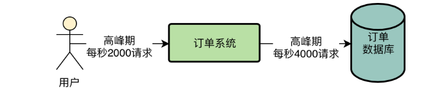

假设我们采用的是高配置的16核32G以及SSD固态硬盘机器。因此观察线上数据库的情况，每秒4000请求的时候，CPU,磁盘，IO等负载较高，基本在承受范围。

秒杀活动会导致系统每秒几千的请求，数据库也会成倍增加。甚至都会上万QPS的请求。

## 高并发订单系统面临的技术痛点总结

1.核心业务流程

2.后台线程定时补偿机制

3.第三方系统耦合

4.核心链路调用失败

5.其他系统获取数据

6.流量洪峰