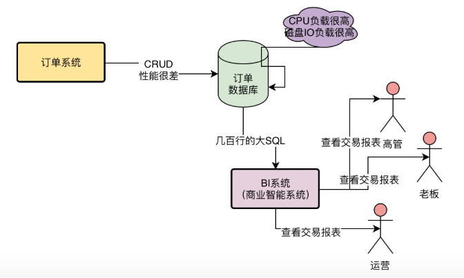
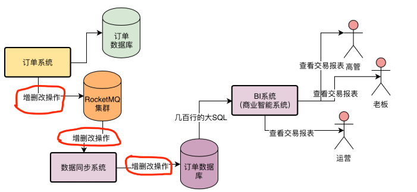
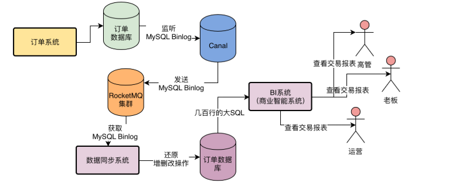
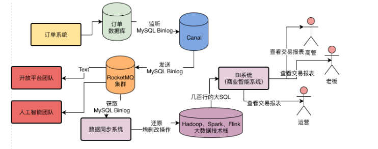

**大数据团队的几百行大SQL是如何影响订单数据库的？**

在图里很清晰地看到，大数据团队的BI系统每天都会直接在订单数据库里执行上百次几百行的大SQL，而每次一个几百行大SQL的执行都需要耗时几秒到十几秒不等

每次这样一个几百行的大SQL执行，都会导致MySQL数据库服务器的资源负载急剧抖动，会让CPU、内存、磁盘IO的负载都瞬间升高。

而一旦MySQL数据库的资源负载瞬间升高，会导致订单系统在MySQL数据库上执行的SQL语句性能出现急剧下降，因此会导致订单系统的性能也出现抖动。

这其实就是大数据团队目前对订单系统的影响。

**3、如何避免大数据团队直接查询订单数据库？**

完全可以由订单系统将订单数据推送到一个MQ里，然后大数据团队从MQ里获取订单数据，接着将订单数据落地到自己的存储中去

比如最简单的办法，就是将订单数据落地到大数据团队自己的一个MySQL数据库中，然后从自己的MySQL数据库里统计报表。

**TopicOrderPaySuccess里的订单支付成功消息可以使用吗？**

下一个问题，订单系统应该如何将订单数据发送到RocketMQ里去呢？

之前我们讲过，已经让订单系统在支付成功的时候，将订单支付成功的消息发送到了RocketMQ里去了，然后其他系统会订阅这个订单支付成功的消息去进行对应的业务处理。

但是这个订单支付成功的消息，足够让大数据团队使用吗？

显然是不行的，因为大数据团队需要的是跟订单数据库一模一样的一份完整的数据，而不仅仅是订单支付成功的消息，所以不能直接使用之前“TopicOrderPaySuccess”这个Topic里的消息。

因此，我们还是需要想办法将完整的订单数据都发送到RocketMQ里去，然后让大数据团队去获取。

**5、如何将完整的订单数据发送到RocketMQ里去？**

实际上一个比较简单的办法，就是在订单系统中但凡对订单执行增删改类的操作，就把这种对订单增删改的操作发送到RocketMQ里去。

然后大数据团队的数据同步系统从RocketMQ里获取到订单增删改的操作，就会在自己的数据库里执行一样的增删改操作。

通过还原执行一样的insert、update和delete语句，就可以在自己的数据库里还原出来一样的订单数据。

 这种方案的一个问题就是订单系统为了将数据同步给大数据团队，必须在自己的代码里耦合大量的代码去发送增删改操作到RocketMQ，这会导致订单系统的代码出现严重的污染，因为这些发送增删改操作到RocketMQ里的代码是跟订单业务没关系的 

MySQL Binlog同步系统

这种系统会监听MySQL数据库的Binlog，所谓Binlog大致可以理解为MySQL的增删改操作日志。

然后MySQL Binlog同步系统会将监听到的MySQL Binlog（也就是增删改操作日志）发送给你的系统，让你来处理这些增删改操作日志。

这种MySQL Binlog系统现在是有不少成熟的开源技术方案的，比如阿里开源的Canal，以及Linkedin开源的Databus，都可以监听MySQL Binlog，然后将MySQL Binlog发送给你的系统，交给你去处理。

因此完全可以将数据同步方案修改为如下所示，采用Canal监听MySQL Binlog，然后直接发送到RocketMQ里

然后大数据团队的数据同步系统从RocketMQ中获取到MySQL Binlog，也就获取到了订单数据库的增删改操作，接着把增删改操作还原到自己的数据库中去就可以。

​	而且这样的一套方案还有一个额外的好处，就是由订单技术团队将完整的订单数据库的MySQL Binlog推送到RocketMQ里

无论是大数据团队，还是未来公司的其他技术团队，比如说开放平台团队，人工智能团队，等等，只要想要订单数据，都可以直接从这个RocketMQ里去获取完整的订单数据。

 实际上大数据团队并没有必要仅仅只通过MySQL来出数据报表，完全可以采用Hadoop、Spark、Flink等大数据技术来出数据报表。 

