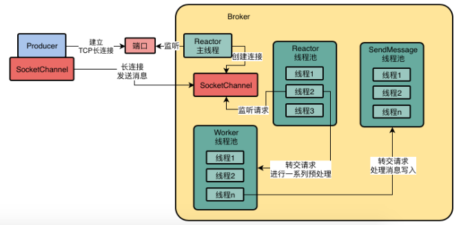

Broker的Reactor主线程负责与Producer创建TCP长连接，建立连接后，producer和Broker各自创建了SocketChannel并建立关联。Reactor主线程建立好的每个连接SocketChannel都会交给Reactor线程池的其中一个线程去监听请求。当一个消息到达Broker的SocketChannel，Reactor线程池里的一个线程会监听这个SocketChannel请求到达。Reactor线程池的线程默认是3个。

当Reactor线程从SocketChannel中读取一个请求时，请求在处理签，会进行一些准备工作和预处理，比如说SSL加密，编码解码，连接空闲检查，网络连接管理，这些处理工作将由Worker线程池来解决，默认是8个线程

当准备工作和预处理由Worker线程池的线程处理完以后，就要处理正式的业务逻辑，写入CommitLog和ConsumeQueue的工作将由业务线程池来处理。比如处理发送消息请求而言，就会把请求转交给sendMessageQueue线程池。

Reactor主线程专门负责跟各种Producer，consumer建立长连接

连接建立好以后，大量的长连接均匀的分配给Reactor线程池里的多个线程

每个Reactor线程负责监听一部分连接的请求，通过多线程并发的监听不同连接的请求，可以有效的提升大量并发请求过来的处理能力

大量并发请求的进一步处理是通过worker线程池来预处理的，当Worker线程池预处理多个请求的时候，Reactor线程还是可以减小监听和接受大量的连接请求。

最终读写磁盘文件的操作都是交给业务线程池来处理的，当并发执行多个请求的磁盘读写操作时候，不影响其他线程池同时接受请求，预处理请求。

RocketMQ的网络通信框架是基于netty，netty是基于Reactor模型实现的