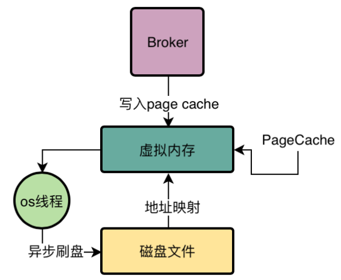

传统文件IO操作的多次数据拷贝

假设一个程序需要读取磁盘文件，读取的顺序是，首先从磁盘上把数据读取到内核IO缓冲区中，然后从内核IO缓存区里读取到用户进程私有空间里，最后程序拿到这个文件的数据。

在上述的流程，读取磁盘文件，发生了两次数据拷贝操作。同样在写入磁盘文件时候，也会发生两次数据拷贝的操作。

RocketMQ利用mmap技术配合oscache技术优化文件读写

通过JDK的NIO包下的MappedByteBuffer的map函数，将一个磁盘文件映射到内存中。虚拟内存地址映射。

mmap技术在进行文件映射的时候，大小限制在1.5GB~2GB之间

所以RocketMQ才让CommitLog单个文件在1GB，ConsumeQueue文件在5.72MB

PageCache就对应于虚拟内存

PageCache会将你加载的数据块临近的其他数据块也一起加载到PageCache中

从上图可以看到，只有一次数据的拷贝操作，优化了磁盘读取和写入的速度

内存预映射机制

Broker会对磁盘上的各种CommitLog，ConsumeQueue文件预先分配好MappedFile，也就是提前对一些可能接下来要读写的磁盘文件提前使用MappedByteBuff执行map()函数完成映射。

文件预热机制

因为映射不会直接将数据加载到内存里来，在提前完成文件映射以后会进行madvise系统调用，就是提前尽可能多的把磁盘文件加载到内存里去。

写磁盘的时候都是通过PageCache，尽可能多的通过map+madvise的映射后预热机制，把磁盘文件里的数据尽可能多的加载到PageCache里去，后续对ConsumeQueue，CommitLog进行读取的时候，才能尽可能从内存里读取数据

