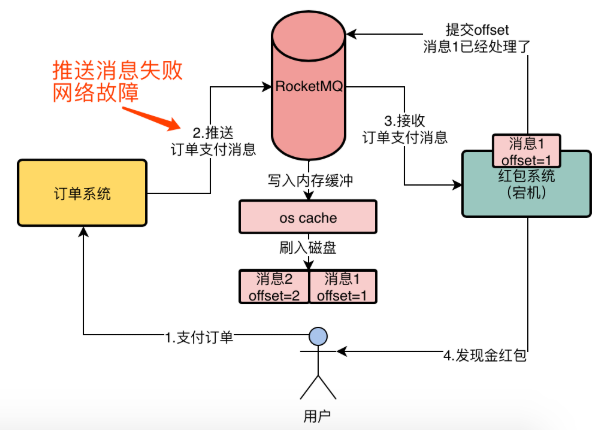
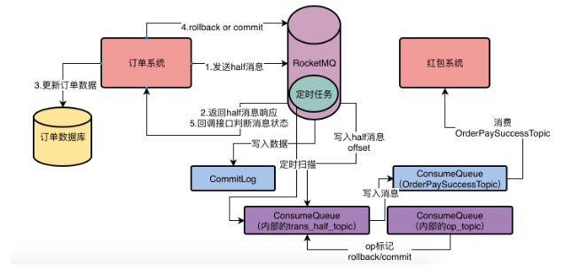
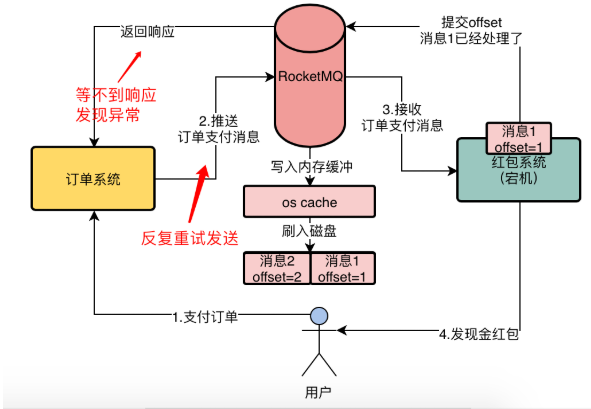
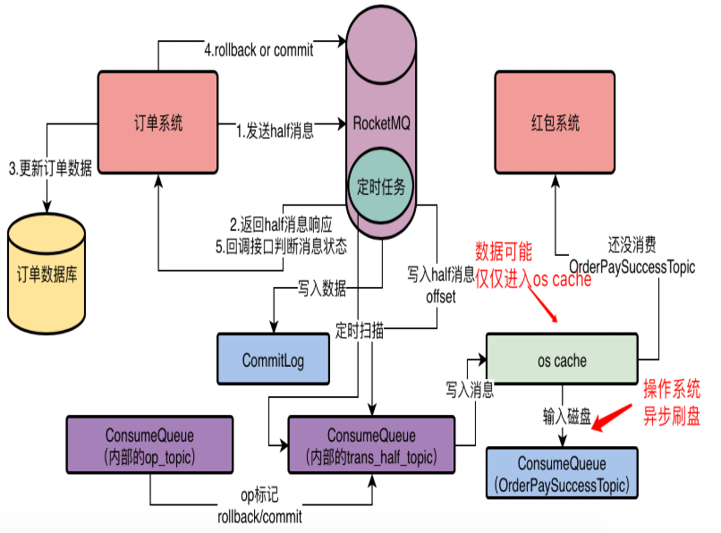
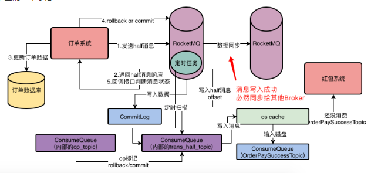
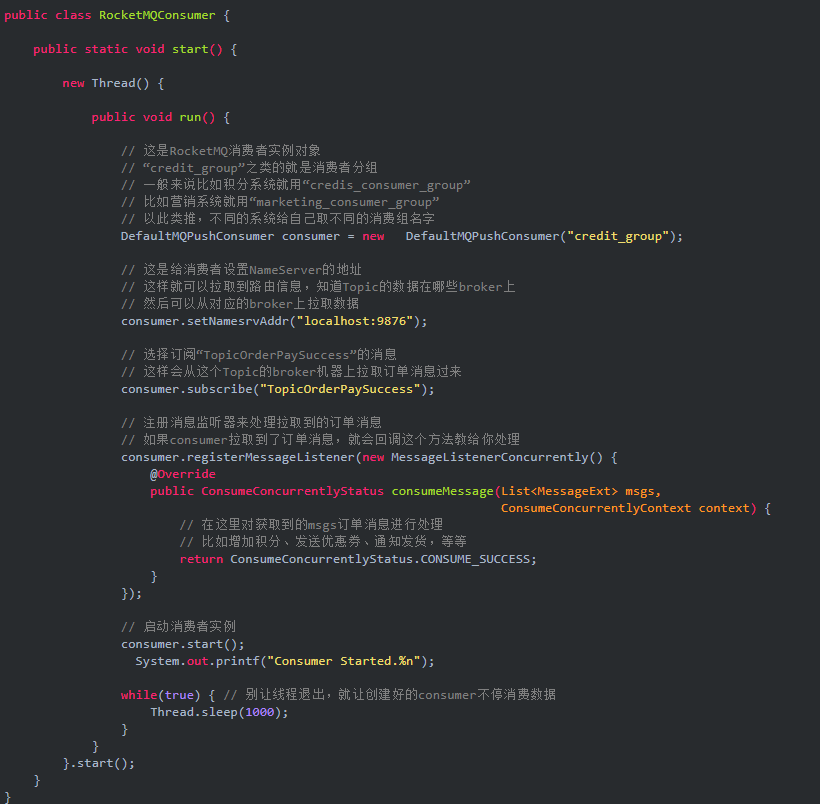

消息丢失的几种情况分析

## 1.假设消息系统正在将消息发送至MQ

订单系统推送消息到RoketMQ过程中，网络连接发生问题，导致消息发送失败

MQ收到了消息，但是MQ的网络通信模块代码出现了异常，导致消息没有处理成功

写消息的时候，刚好遇到某个Leader Broker故障，Flower Broker正在切换为LeaderBroker

解决方案

1.事务消息

2.同步+重试

## 2.假设订单系统成功将消息写入MQ

Broker机器宕机，但此时消息还只是存在于oscache，还未来得及写入磁盘，内存数据丢失

在实施1里的解决方案后，消息会保证投递到MQ。

但是确保消息写入了MQ，并不能保证消息不丢失

如何解决

同步刷盘：写入MQ的每条消息，，调整broker的配置文件，将flushDiskType配置设置为SYNC_FLUSH,默认他的值是ASYNC_FLUSH 即默认是异步刷盘。

同步刷盘写入MQ的消息肯定是写入了磁盘而不是oscache

## 3.假设订单消息已经成功写入MQ的broker磁盘中

磁盘故障，导致写入的数据丢失。

如何解决：

基于MQ的Dledger技术和Raft协议主从架构模式避免磁盘故障导致数据丢失

必须让一个masterBroker有一个SlaveBroker去同步他的数据，而且一条消息写入master成功，必须保证slaveBroker也写入成功，保证数据有多个副本

## 4.假设消息已经被消费者获取

假设消息已到达消费者内存中，但在消费者内存中还未开始消费逻辑处理，MQ的消费者有可能会自动提交已经消费的offset，那么如果此时消费者还没处理这个消息的情况下，消费者直接自动提交了这个消息1的offset的broker中，表示消费者已经成功处理offset1的消息，接着恰巧在这个时候，我们红包系统突然宕机或者重启，或者在逻辑处理时数据库更新失败，内存里的消息还未正式消费就丢失了，导致业务没有真正处理。

解决方案：

RocketMQ的消费者会注册一个监听器，MessageListenerConcurrently这个东西，当消费者获取到一批消息后，就会回调监听器函数来处理消息。当消息处理完毕以后，就会返回消费成功的标志，ConsumerConcurrentlyStatus.CONSUME_SUCCESS，告诉MQ，这批消息已经处理完了。