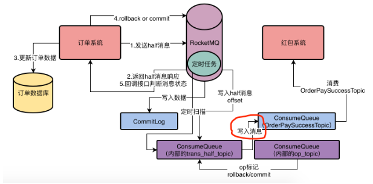
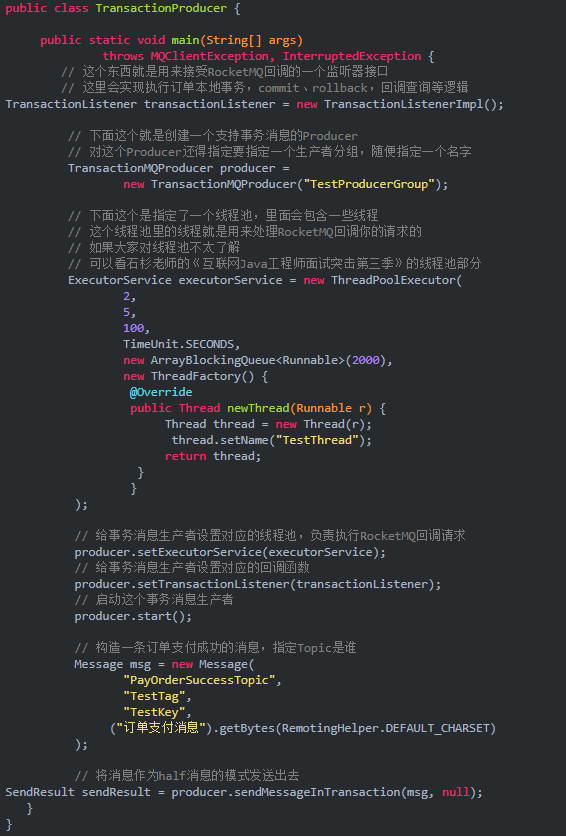
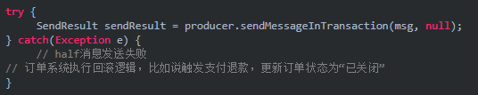
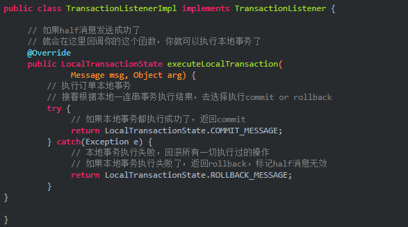
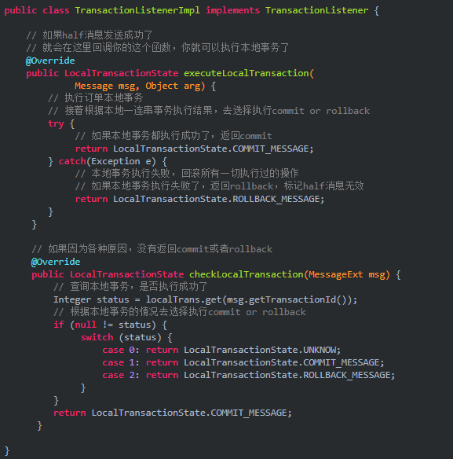

half如何对消费者不可见

当个half消息发送到RocketMQ时，并不会把他写入该消息所在topic的ConsumeQueue，它会将该消息存入MQ内部自己的一个“RMQ_SYS_TRANS_HALF_TOPIC”的topic对应的一个ConsumeQueue里去。

当half消息进入到了RocketMQ内部的“RMQ_SYS_TRANS_HALF_TOPIC”的ConsumeQueue文件中时，就表示half消息已经写入成功，然后就会返回响应给订单系统。

RocketMQ后台会有定时任务扫描“RMQ_SYS_TRANS_HALF_TOPIC”中的half消息，如果超过一定时间还是half消息，mq会回调生产者接口，最多回调15次，如果15次只有都没法告知half消息的状态，就会把消息标记为rollback

如果执行了rollback请求，就对消息进行回滚操作，RocketMQ会删除half消息，但这个删除并不是真正的删除，他会用一个OP操作来标记half消息的状态

当提交commit，如何对消费者可见

执行commit后，RocketMQ会在OP_TOPIC里写入一条记录，标记half消息已经是commit状态了。

接着要把放在RMQ_SYS_TRANS_HALF_TOPIC中的half消息写入到消息指定的ConsumeQueue中，消费者就可以对这条消息开始消费。

## 解决方案

解决方法1：事务消息

通过RocketMQ事务消息机制来保证生产者推送给Broker的消息一定会写入，不会半路丢失消息

在基于RocketMQ的事务消息机制中，首先生产者发送一条half消息到MQ去，这个half消息还不能被消费者所消费，如果half消息发送失败，则回滚生产者逻辑。如果half消息发送成功，则生产者正常执行本地逻辑。

假设生产者在之后的逻辑中更新数据失败了，则生产者发送rollback请求给MQ，要求MQ删除之前的half消息，生产者随后回滚本地业务逻辑。

假设生产者完成了本地事务操作，此时生产者发送commit请求给MQ，要求MQ对之前的half消息进行commit操作，让消费者可以消费这条消息。

假设生产者发送half消息给MQ，MQ保存下来了，但是MQ返回给我们的响应没有收到，生产者没收到响应，则回滚本地业务逻辑，MQ存储下来的half消息怎么处理？

假设生产者收到half消息写入成功的响应，业务逻辑也执行完毕，但是发送commit和rollback请求给MQ失败了，MQ存储下来的half消息怎么处理？

假设生产者收到half消息写入成功的响应，业务逻辑也执行完毕，但是发送commit和rollback请求给MQ后,MQ宕机了，MQ重启后对存储下来的half消息怎么处理？

RocketMQ有一个补偿逻辑，他会扫描自己处于half状态的消息，如果我们一直没有对这个消息执行commit/rollback操作，超过一定的时间，就会回调生产者的接口，询问该消息如何处理。重启后也会扫描half消息，执行补偿逻辑。

解决方法2：同步发送消息+反复重试

生产者发送消息给MQ，MQ在写入OScache或者本地磁盘时，返回响应给生产者，生产者发送消息后，同步等待MQ返回响应，如果网络异常或者MQ内部异常，生产者捕捉到异常后，就认为MQ发送失败，重试尝试发送消息给MQ，等待MQ返回响应。

假设先执行生产者本地事务，再发送消息到MQ

先执行订单本地事务，接着发送消息，如果本地事务失败，则不会继续发送消息到MQ，如果本地事务执行成功，发送MQ失败了，自动进行重试，如果一直失败，则回滚订单事务

但是如果本地事务执行完成提交，还没有发送MQ消息，本地应用崩溃宕机，订单状态修改成功，MQ发送失败。

如果将本地事务和MQ放到一个事务中，会导致接口性能大幅度降低，假设支付系统回调你的订单系统，告知支付成功，但是订单系统卡在多次重试MQ，会导致支付系统回调超时异常。

如果将本地事务和MQ放到一个事务中，在事务中还存在redis和es的代码逻辑，更加无法回滚。基于本地事务实现自动回滚有弊端。

解决方案2是有弊端和局限性的，所以目前最好的解决方案就是1.

## 代码实现

half消息发送

half消息发送失败

half消息成功，执行本地订单事务

mq没有返回commit或者rollback，mq回调

