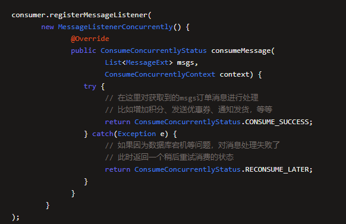

如果数据库宕机等问题，对消息的处理时异常的， 没法处理这批消息，那么我们应该返回RECONSUME_LATER状态，标识没法完成这批消息的处理，稍后过段时间再次重新发送尝试继续处理。

当消费者返回RECONSUME_LATER状态后，MQ会把这批消息放入另外一个消费组的重试队列中

假设消费者组的名称为VoucherConsumeGroup   优惠系统的消费组，那么就会有一个%RETRY%VoucherConsumerGroup 的重试队列

默认最多是重试16次。

messageDelayLevel = 1s 5s 10s 30s  1m  2m  3m  4m  5m 6m 7m 8m 9m 10m 20m 30m 1h 2h

重试16次还是无法处理，就会将这批消息存入死信队列

死信队列的名字为 %DLQ%VoucherConsumeGroup   

死信队列的处理可以通过订阅 %DLQ%VoucherConsumeGroup 私信队列，对死信队列的消息重新进行处理。