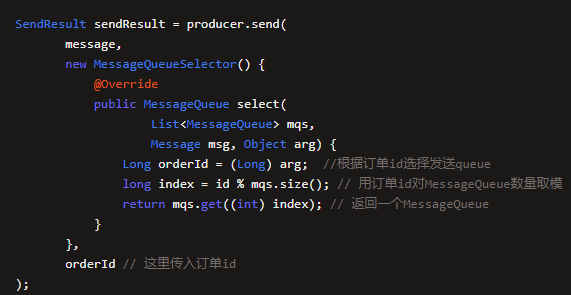

## 消息乱序

让大数据系统直接跑复杂的SQL在MYSQL上来生成数据报表，严重影响订单系统的性能，通过canal这样的中间件来监听数据库的binlog，将binlog发送到MQ中

给每个Topic指定多个MessageQueue，然后你写入消息的时候，其实是会把消息均匀分发给不同的MessageQueue，写入消息的时候会均匀的发给不同的MessageQueue，insert binlog和update binlog分别写入不同的MessageQueue，不同的消费者去消费的时候会导致顺序乱序。

## 解决方法

让同一个订单的binlog进入一个MessageQueue。具体做法是通过对订单号进行取模，取模后结果一致的存入一个MessageQueue

一个Consumer可以处理多个MessageQueue的消息，但是一个MessageQueue只能交给一个ConsumeQueue来进行处理，所以一个订单的binlog只会有序的交给一个Consumer来进行处理，当出现消息处理失败的场景时，就必须返回SUSPEND_CURRENT_QUEUE_A_MOMENT这个状态，意思是先等一会，一会再继续处理这批消息，而不能把这批消息放入重试队列，然后直接处理下一批消息。

要综合的考虑和其他方案的处理。

## 代码实现

生产者代码

消费者代码

org.apache.rocketmq.client.consumer.listener.MessageListenerOrderly

一个MessageListener Concurrently对象用于按顺序接收异步传递的消息。一个队列，一个线程。

举例来说，对ComsumeQueue01中的订单id=1100的多个binlog，会交给一个线程按照binlog顺序来依次处理。否则如果交给多个线程处理，还是会出现消息乱序的问题

