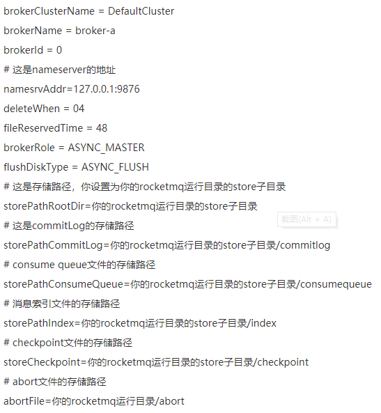

## Namesrv启动

org.apache.rocketmq.namesrv.NamesrvStartup.main(String[])

配置环境变量

ROCKETMQ_HOME   =  D:\rocketmq-nameserver

在上面环境变量指定的目录中创建三个文件夹

conf

logs

store

将RocketMQ源码目录中distrbution目录下的broker.conf  logback_namesvr.xml  两个配置文件拷贝到刚才新建的conf目录

 logback_namesvr.xml    里的 ${user.home}   替换为环境变量指定的运行目录

broker.conf

设置成

## broker启动

指定broker的配置文件    -c

设置环境变量

