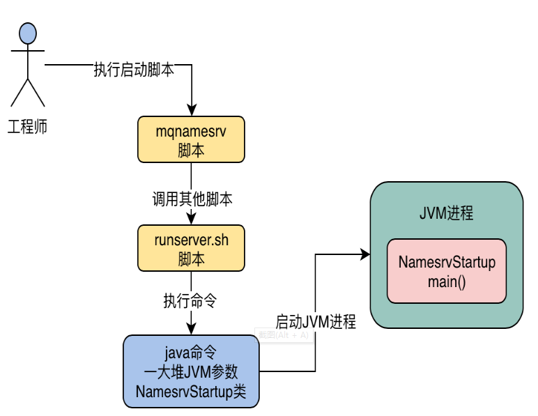
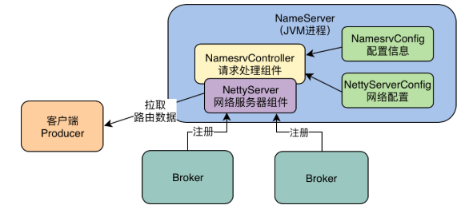
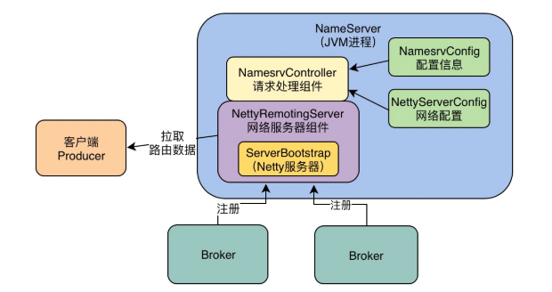

org.apache.rocketmq.namesrv.NamesrvController

        final NamesrvConfig namesrvConfig = new NamesrvConfig();
        final NettyServerConfig nettyServerConfig = new NettyServerConfig();

org.apache.rocketmq.remoting.netty.NettyRemotingServer

io.netty.bootstrap.ServerBootstrap

org.apache.rocketmq.remoting.netty.NettyRemotingServer.start()

