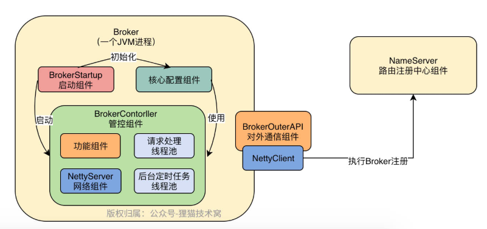
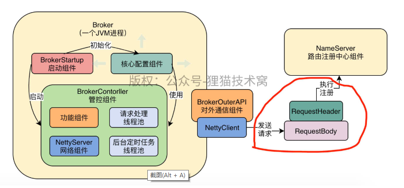
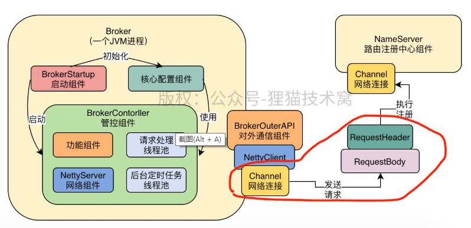

## Broker启动

（1）Broker启动了，必然要去注册自己到NameServer去，所以BrokerOuterAPI这个组件必须要画到自己的图里去，这是一个核心组件

（2）Broker启动之后，必然要有一个网络服务器去接收别人的请求，此时NettyServer这个组件是必须要知道的

（3）当你的NettyServer接收到网络请求之后，需要有线程池来处理，你需要知道这里应该有一个处理各种请求的线程池

（4）你处理请求的线程池在处理每个请求的时候，是不是需要各种核心功能组件的协调？比如写入消息到commitlog，然后写入索引到indexfile和consumer queue文件里去，此时你是不是需要对应的一些MessageStore之类的组件来配合你？

（5）除此之外，你是不是需要一些后台定时调度运行的线程来工作？比如定时发送心跳到NameServer去，类似这种事情。

## Broker注册NameServer

org.apache.rocketmq.remoting.netty.NettyRemotingClient.invokeSync(String, RemotingCommand, long)

org.apache.rocketmq.remoting.netty.NettyRemotingClient.createChannel(String)

org.apache.rocketmq.namesrv.processor.DefaultRequestProcessor.registerBroker(ChannelHandlerContext, RemotingCommand)

org.apache.rocketmq.namesrv.routeinfo.RouteInfoManager.registerBroker(String, String, String, long, String, TopicConfigSerializeWrapper, List<String>, Channel)

NameServer核心其实就是基于Netty服务器来接收Broker注册请求，然后交给DefaultRequestProcessor这个请求处理组件，来处理Broker注册请求。

Broker注册的逻辑是放在RouteInfoManager这个路由数据管理组件里来进行实现的，最终Broker路由数据都会存放在RouteInfoManager内部的一些Map数据结构组成的路由数据表中。

