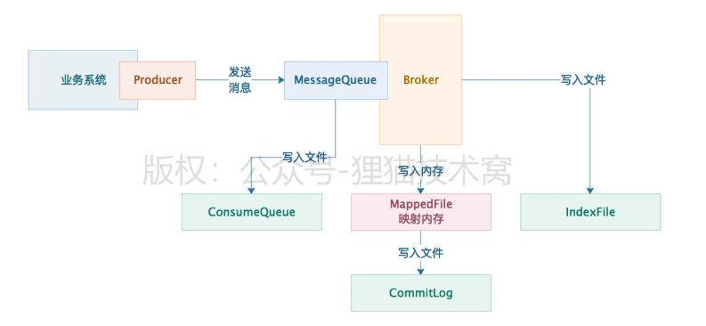
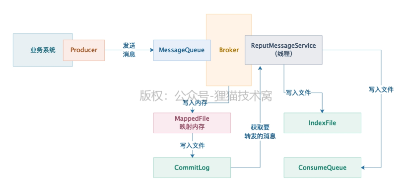
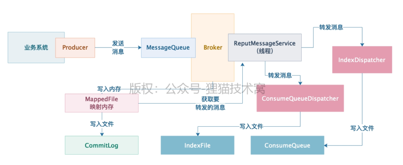

## Broker启动

（1）Broker启动了，必然要去注册自己到NameServer去，所以BrokerOuterAPI这个组件必须要画到自己的图里去，这是一个核心组件

（2）Broker启动之后，必然要有一个网络服务器去接收别人的请求，此时NettyServer这个组件是必须要知道的

（3）当你的NettyServer接收到网络请求之后，需要有线程池来处理，你需要知道这里应该有一个处理各种请求的线程池

（4）你处理请求的线程池在处理每个请求的时候，是不是需要各种核心功能组件的协调？比如写入消息到commitlog，然后写入索引到indexfile和consumer queue文件里去，此时你是不是需要对应的一些MessageStore之类的组件来配合你？

（5）除此之外，你是不是需要一些后台定时调度运行的线程来工作？比如定时发送心跳到NameServer去，类似这种事情。

## Broker注册NameServer

org.apache.rocketmq.remoting.netty.NettyRemotingClient.invokeSync(String, RemotingCommand, long)

org.apache.rocketmq.remoting.netty.NettyRemotingClient.createChannel(String)

org.apache.rocketmq.namesrv.processor.DefaultRequestProcessor.registerBroker(ChannelHandlerContext, RemotingCommand)

org.apache.rocketmq.namesrv.routeinfo.RouteInfoManager.registerBroker(String, String, String, long, String, TopicConfigSerializeWrapper, List<String>, Channel)

NameServer核心其实就是基于Netty服务器来接收Broker注册请求，然后交给DefaultRequestProcessor这个请求处理组件，来处理Broker注册请求。

Broker注册的逻辑是放在RouteInfoManager这个路由数据管理组件里来进行实现的，最终Broker路由数据都会存放在RouteInfoManager内部的一些Map数据结构组成的路由数据表中。

BrokerController.start()方法中，在BrokerController启动的时候，他其实并不是仅仅发送一次注册请求，而是启动了一个定时任务，会每隔一段时间就发送一次注册请求。默认是每隔30s就会执行一次Broker注册的过程

## 接受消息并存储

org.apache.rocketmq.store.DefaultMessageStore.DefaultMessageStore(MessageStoreConfig, BrokerStatsManager, MessageArrivingListener, BrokerConfig)

org.apache.rocketmq.store.CommitLog.DefaultAppendMessageCallback.doAppend(long, ByteBuffer, int, MessageExtBatch)

org.apache.rocketmq.store.DefaultMessageStore.ReputMessageService.doReput()

org.apache.rocketmq.store.DefaultMessageStore.doDispatch(DispatchRequest)

将消息转发到consumequeue和indexfile

org.apache.rocketmq.store.DefaultMessageStore.CommitLogDispatcherBuildIndex.dispatch(DispatchRequest)	

org.apache.rocketmq.store.DefaultMessageStore.putMessagePositionInfo(DispatchRequest)

同步刷盘,异步刷盘

org.apache.rocketmq.store.CommitLog.putMessage(MessageExtBrokerInner)

        handleDiskFlush(result, putMessageResult, msg);
        handleHA(result, putMessageResult, msg);

org.apache.rocketmq.store.CommitLog.handleDiskFlush(AppendMessageResult, PutMessageResult, MessageExt)

同步刷盘

构建GroupCommitRequest发送给GroupCommitService执行

org.apache.rocketmq.store.CommitLog.GroupCommitService.doCommit()

org.apache.rocketmq.store.MappedFileQueue.flush(int)

org.apache.rocketmq.store.MappedFile.flush(int)

java.nio.MappedByteBuffer.force()

异步刷盘

org.apache.rocketmq.store.CommitLog.GroupCommitService

org.apache.rocketmq.store.CommitLog.FlushCommitLogService

org.apache.rocketmq.store.CommitLog.CommitRealTimeService.run()

CommitRealTimeService提交线程工作机制

FlushRealTimeService 刷盘线程工作机制

CommitRealTimeService 只是提交数据到bytebuffer中的线程，FlushRealTimeService 才是真正执行10秒一次将bytebuffer中的数据进行刷盘的真正任务

## 当Broker上的数据存储超过一定时间之后，磁盘数据是如何清理的

org.apache.rocketmq.store.DefaultMessageStore.start()

this.addScheduleTask();

org.apache.rocketmq.store.DefaultMessageStore.CleanCommitLogService.run()

org.apache.rocketmq.store.DefaultMessageStore.CleanCommitLogService.deleteExpiredFiles()

默认broker只会保留3天，DefaultMessageStore每10秒执行一个后台任务。默认凌晨4点或者超过磁盘85%，触发删文件的逻辑，90%不允许写入新文件，需要立马删除文件。即使未消费，也要删除。