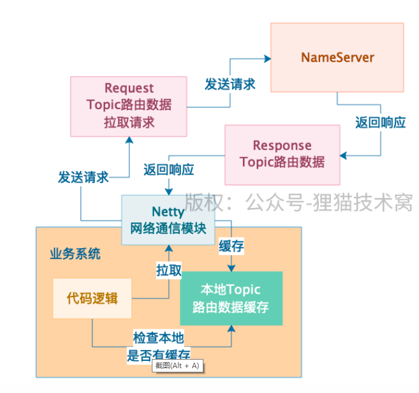
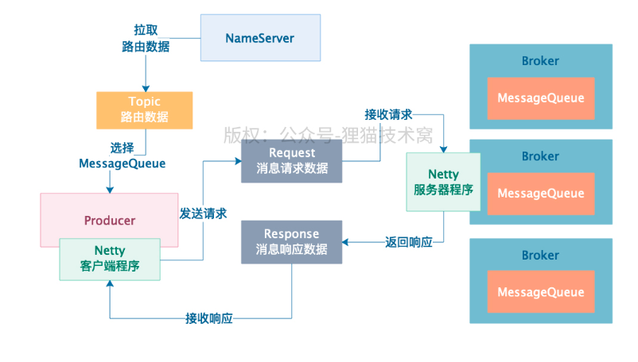

DefaultMQProducerImpl     

在第一次发送消息到Topic的时候，会跟Broker建立连接，才会去拉取一个Topic的路由数据，包括这个Topic有几个MessageQueue，每个MessageQueue在哪个Broker上，然后从中选择一个MessageQueue，跟那台Broker建立网络连接，发送消息过去

发送消息

org.apache.rocketmq.client.impl.producer.DefaultMQProducerImpl.sendDefaultImpl(Message, CommunicationMode, SendCallback, long)

查找topic

org.apache.rocketmq.client.impl.producer.DefaultMQProducerImpl.tryToFindTopicPublishInfo(String)

获取路由

org.apache.rocketmq.client.impl.factory.MQClientInstance.updateTopicRouteInfoFromNameServer(String, boolean, DefaultMQProducer)

查找MessageQueue

org.apache.rocketmq.client.impl.producer.DefaultMQProducerImpl.selectOneMessageQueue(TopicPublishInfo, String)

broker规避

发送

org.apache.rocketmq.client.impl.producer.DefaultMQProducerImpl.sendKernelImpl(Message, MessageQueue, CommunicationMode, SendCallback, TopicPublishInfo, long)

给消息分配全局唯一ID、对超过4KB的消息体进行压缩，在消息Request中包含了生产者组、Topic名称、Topic的MessageQueue数量、MessageQueue的ID、消息发送时间、消息的flag、消息扩展属性、消息重试次数、是否是批量发送的消息、如果是事务消息则带上prepared标记，等等。

