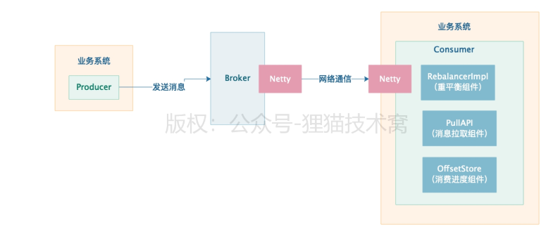

org.apache.rocketmq.client.impl.consumer.DefaultMQPushConsumerImpl.start()


this.mQClientFactory = MQClientManager.getInstance()

.getOrCreateMQClientInstance(this.defaultMQPushConsumer, this.rpcHook);


rebalanceImpl负责Consumer的MessageQueue的重平衡

```java
this.rebalanceImpl.setConsumerGroup
(this.defaultMQPushConsumer.getConsumerGroup());

this.rebalanceImpl.setMessageModel
(this.defaultMQPushConsumer.getMessageModel());

this.rebalanceImpl.setAllocateMessageQueueStrategy
(this.defaultMQPushConsumer.getAllocateMessageQueueStrategy());

this.rebalanceImpl.setmQClientFactory(this.mQClientFactory);
```


拉取消息

                this.pullAPIWrapper = new PullAPIWrapper(
                    mQClientFactory,
                    this.defaultMQPushConsumer.getConsumerGroup(), isUnitMode());
                this.pullAPIWrapper.registerFilterMessageHook(filterMessageHookList);


存储和管理Consumer消费进度offset的一个组件


                if (this.defaultMQPushConsumer.getOffsetStore() != null) {
                    this.offsetStore = this.defaultMQPushConsumer.getOffsetStore();
                } else {
                    switch (this.defaultMQPushConsumer.getMessageModel()) {
                        case BROADCASTING:
                            this.offsetStore = new LocalFileOffsetStore(this.mQClientFactory, this.defaultMQPushConsumer.getConsumerGroup());
                            break;
                        case CLUSTERING:
                            this.offsetStore = new RemoteBrokerOffsetStore(this.mQClientFactory, this.defaultMQPushConsumer.getConsumerGroup());
                            break;
                        default:
                            break;
                    }
                    this.defaultMQPushConsumer.setOffsetStore(this.offsetStore);
                }
                this.offsetStore.load();


Consumer刚启动，必须依赖Rebalance组件，进行重平衡，分配MessageQueue拉取消息，拉取消息需要通过PullAPI组件通过底层网络通信拉取，拉取过程需要维护offset消费进度。





一个消费组中的多个Consumer是如何均匀分配消息队列的

多个consumer构成一个consumerGroup，一个消费者组消费一个topic，一个topic 的有多个MessageQueue分布在多个broker

假设消费者组里有2个consumer，那么一个topic有三个MessageQueue，该怎么分配

consumer负载均衡

rebanlance重平衡组件是如何将多个MessageQueue均匀分配给一个消费者组的多个Consumer？

每个Consumer在启动之后，都会向所有broker进行注册，并且持续保持自己的心跳，让每个broker都能感知到一个消费者组内有哪些Consumer

每个Consumer在启动之后，重平衡组件都会随机挑选一个broker，从里面获取到这个消费者组有哪些Consumer存在，重平衡组件知道了消费者组内有哪些Consumer后，就把Topic下的MessageQueue均匀分配给这些Consumer。


比如现在一共有3个MessageQueue，然后有2个Consumer，那么此时就会给1个Consumer分配2个 MessageQueue，同时给另外1个Consumer分配剩余的1个MessageQueue。 假设有4个MessageQueue的话，那么就可以2个Consumer每个人分配2个MessageQueue了，总之，一切都是平均分配的，尽量保证每个Consumer的负载是差不多的。 这样的话，一旦MessageQueue负载确定了之后，下一步其实Consumer就知道自己要消费哪几个MessageQueue的 消息了，就可以连接到那个Broker上去，从里面不停的拉取消息过来进行消费了


Topic中的多个MessageQueue会分散在多个Broker上，在每个 Broker机器上，一个MessageQueue就对应了一个ConsumeQueue，当然在物理磁盘上其实是对应了多个 ConsumeQueue文件的，

对于一个Broker机器而言，存储在他上面的所有Topic以及MessageQueue的消息数据都是写入一个统一的 CommitLog

于Topic的各个MessageQueue而言，就是通过各个ConsumeQueue文件来存储属于MessageQueue的消息 在CommitLog文件中的物理地址，就是一个offset偏移量

一个MessageQueue只能被一个消费机器去处理，但是一台消费者机器可以负责多个MessageQueue的消息处 理

是集群模式，也就是说，一个消费组获取到一条消息，只会交给组内的一台机器去处理，不是每台 机器都可以获取到这条消息的

为广播模式，那么对于消费组获取到的一条消息，组内每台机器都可以获取到这条消息

如果消费组中出现机器宕机或者扩容加机器，会进入一个rabalance的环节，也就是说重新给各个消费机器分配他们要处理的MessageQueue。

拉取消息的源码入口是在DefaultMQPushConsumerImpl类的 pullMessage()方法中的，这个里面涉及到了拉取请求、消息流量控制、通过PullAPIWrapper与服务端进行网络交 互、服务端根据ConsumeQueue文件拉取消息，等一系列的事情