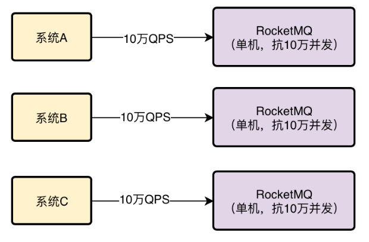
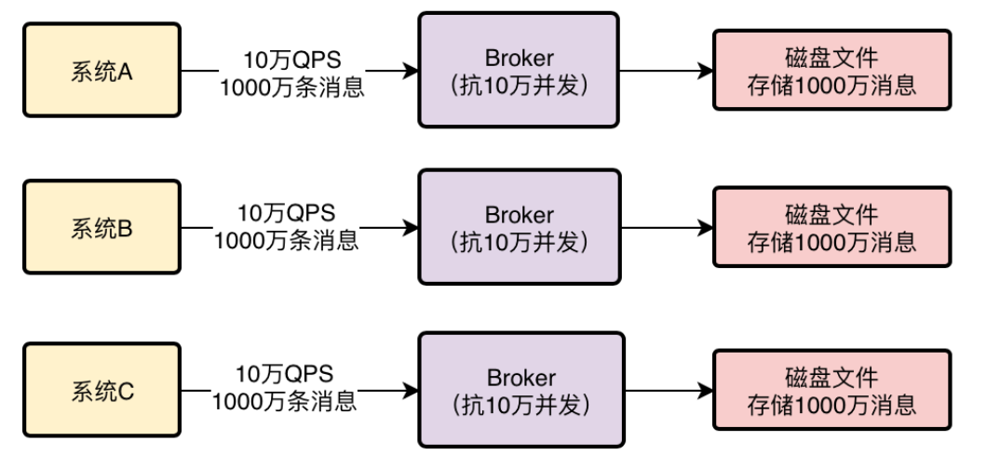
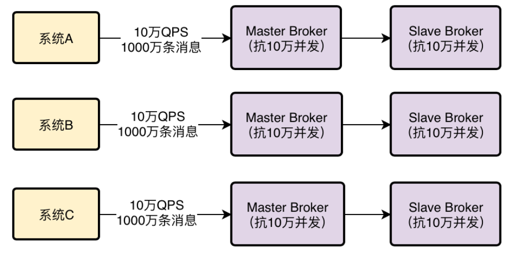
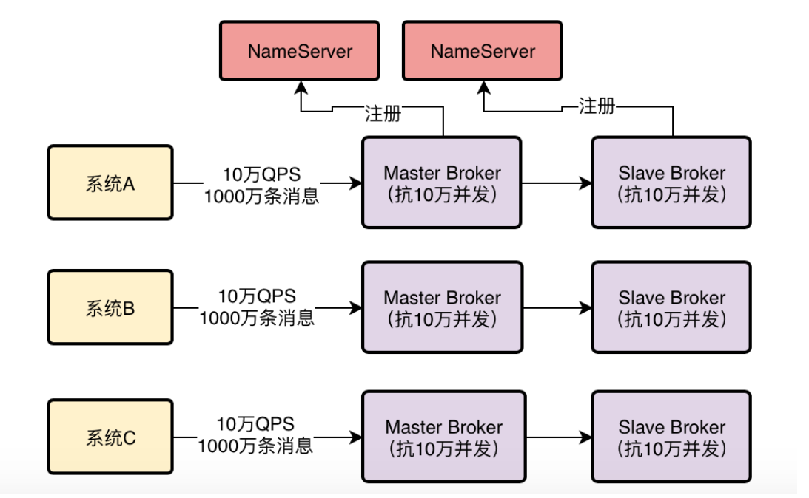
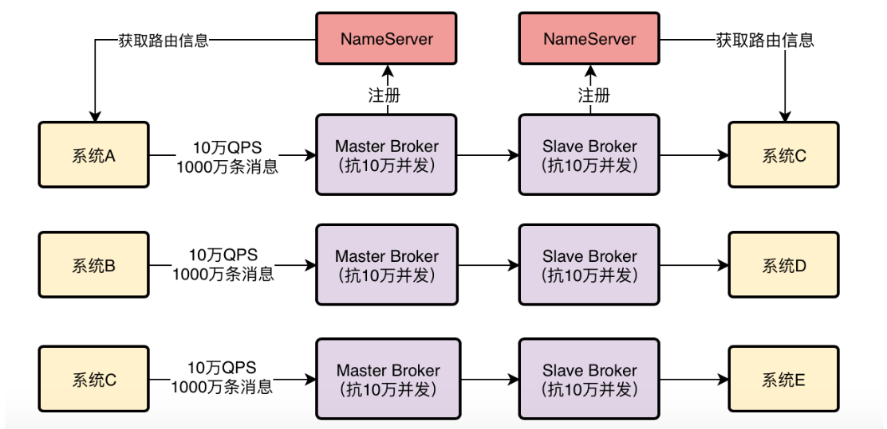

## RocketMQ是如何集群化部署来承载高并发访问的？

假设RocketMQ部署在一台机器上，即使这台机器配置很高，但是一般来说一台机器也就是支撑10万+的并发访问。 

假设有大量的系统都要往RocketMQ里高并发的写入消息，可能达到每秒有几十万请求，这个时候怎么办呢？

没关系，RocketMQ是可以集群化部署的，可以部署在多台机器上，假设每台机器都能抗10万并发，然后你只要让几十万请求分散到多台机器上就可以了，让每台机器承受的QPS不超过10万不就行了。

## 如果RocketMQ中要存储海量消息，如何实现分布式存储架构？

MQ会收到大量的消息，这些消息并不是立马就会被所有的消费方获取过去消费的，所以一般MQ都得把消息在自己本地磁盘存储起来，然后等待消费方获取消息去处理。 

既然如此，MQ就得存储大量的消息，可能是几百万条，可能几亿条，甚至万亿条，这么多的消息在一台机器上肯定是没法存储的，RocketMQ是如何分布式存储海量消息的呢？ 

其实发送消息到MQ的系统会把消息分散发送给多台不同的机器，假设一共有1万条消息，分散发送给10台机器，可能每台机器就是接收到1000条消息，如下图： 

其次，每台机器上部署的RocketMQ进程一般称之为Broker，每个Broker都会收到不同的消息，然后就会把这批消息存储在自己本地的磁盘文件里 ， 假设你有1亿条消息，然后有10台机器部署了RocketMQ的Broker，理论上不就可以让每台机器存储1000万条消息 

本质上RocketMQ存储海量消息的机制就是分布式的存储 

所谓分布式存储，就是把数据分散在多台机器上来存储，每台机器存储一部分消息，这样多台机器加起来就可以存储海量消息了！ 

##  **高可用保障：万一Broker宕机了怎么办？** 

 要是任何一台Broker突然宕机了怎么办？那不就会导致RocketMQ里一部分的消息就没了吗？这就会导致MQ的不可靠和不可用，这个问题怎么解决？ 

 RocketMQ的解决思路是Broker主从架构以及多副本策略 。

 Master Broker收到消息之后会同步给Slave Broker，这样Slave Broker上就能有一模一样的一份副本数据！ 

这样同一条消息在RocketMQ整个集群里不就有两个副本了，一个在Master Broker里，一个在Slave Broker里！

这个时候如果任何一个Master Broker出现故障，还有一个Slave Broker上有一份数据副本，可以保证数据不丢失，还能继续对外提供服务，保证了MQ的可靠性和高可用性

##  **数据路由：怎么知道访问哪个Broker？** 

对于系统来说，要发送消息到MQ里去，还要从MQ里消费消息

那么大家怎么知道有哪些Broker？怎么知道要连接到哪一台Broker上去发送和接收消息？这是一个大问题！

所以RocketMQ为了解决这个问题，有一个NameServer的概念，他也是独立部署在几台机器上的，然后所有的Broker都会把自己注册到NameServer上去，NameServer不就知道集群里有哪些Broker了？

然后对于我们的系统而言，如果他要发送消息到Broker，会找NameServer去获取路由信息，就是集群里有哪些Broker等信息

如果系统要从Broker获取消息，也会找NameServer获取路由信息，去找到对应的Broker获取消息。

## 