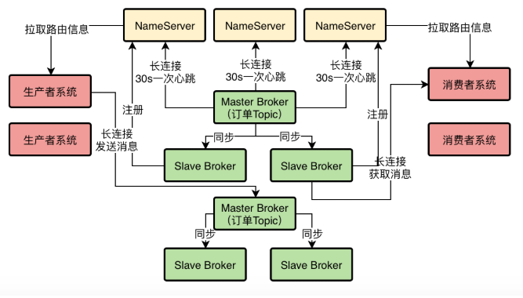
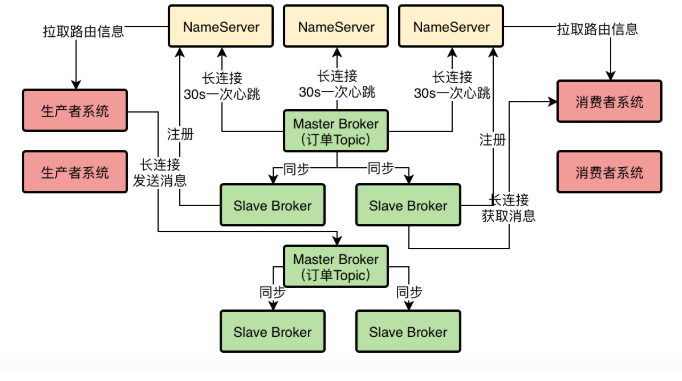

所谓的压测到底是如何压测？难道就是简单的启动几台机器上的生产者和消费者，然后每台机器都开启大量线程模拟并发写入RocketMQ以及并发从RocketMQ上读取消息吗？ 

难道就是不停的增加压测用的生产者和消费者的机器，同时不停的增加他们的线程，然后去看RocketMQ集群的极限在哪里吗？

 其实如果对一个小规模的RocketMQ集群进行疯狂的压测，最后压测出来一个最大的极限TPS值，那只是压测中我们想要的一个结果而已，并不是实际中的最理想结果。 

什么意思呢？

假设我们现在对部署好的RocketMQ集群拼命进行压测，不停的增加生产者和消费者的机器以及线程数量，不停的增加RocketMQ集群的并发写入量和并发消费量，发现RocketMQ集群似乎可以抗下每秒10万+的消息量

那么你觉得在生产环境上，我们可以放心的让RocketMQ集群来抗这么高的TPS吗？

显然不是，因为我们在压测的时候一方面要关注RocketMQ能抗下多少TPS，一方面还要关注RocketMQ部署的几台机器的资源使用率和负载情况。

 比如RocketMQ集群在抗下10万TPS（可以理解为每秒处理10万条消息）的同时，结果机器的CPU负载达到100%，内存几乎消耗殆尽，IO负载极高，网卡流量打满甚至快要打爆，此时你觉得这个10万TPS的成本是不是太高了？ 

因为眼看着你抗下了超高的TPS，结果自己机器资源消耗殆尽，几乎机器都快挂了，那么你在真正的生产环境能放心的允许RocketMQ集群抗到10万TPS吗？

 显然是不行的，因为在机器快挂掉的情况下让中间件抗超高的负载是绝对不行的。 

 所以这种压测方法，仅仅能压测出来一个极限值而已。实际上我们平时做压测，主要关注的还是要压测出来一个最合适的最高负载。 

什么叫最合适的最高负载呢？

意思就是**在RocketMQ的TPS和机器的资源使用率和负载之间取得一个平衡。**

比如RocketMQ集群在机器资源使用率极高的极端情况下可以扛到10万TPS，但是当他仅仅抗下8万TPS的时候，你会发现cpu负载、内存使用率、IO负载和网卡流量，都负载较高，但是可以接受，机器比较安全，不至于宕机。

那么这个8万TPS实际上就是最合适的一个最高负载，也就是说，哪怕生产环境中极端情况下，RocketMQ的TPS飙升到8万TPS，你知道机器资源也是大致可以抗下来的，不至于出现机器宕机的情况。

所以我们做压测，其实最主要的是综合TPS以及机器负载，尽量找到一个最高的TPS同时机器的各项负载在可承受范围之内，这才是压测的目的。

 **2、一次RocketMQ小规模集群的压测** 

（1）RocketMQ的TPS和消息延时

我们让两个Producer不停的往RocketMQ集群发送消息，每个Producer所在机器启动了80个线程，相当于每台机器有80个线程并发的往RocketMQ集群写入消息。

而RocketMQ集群是1主2从组成的一个dledger模式的高可用集群，只有一个Master Broker会接收消息的写入。

然后有2个Cosumer不停的从RocketMQ集群消费数据。

每条数据的大小是500个字节，**这个非常关键**，大家一定要牢记这个数字，因为这个数字是跟后续的网卡流量有关的。

我们发现，一条消息从Producer生产出来到经过RocketMQ的Broker存储下来，再到被Consumer消费，基本上这个时间跨度不会超过1秒钟，这些这个性能是正常而且可以接受的。

同时在RocketMQ的管理工作台中可以看到，Master Broker的TPS（也就是每秒处理消息的数量），可以稳定的达到7万左右，也就是每秒可以稳定处理7万消息。

（2）cpu负载情况

其次我们检查了一下Broker机器上的CPU负载，可以通过top、uptime等命令来查看

比如执行top命令就可以看到cpu load和cpu使用率，这就代表了cpu的负载情况。

在你执行了top命令之后，往往可以看到如下一行信息：

load average：12.03，12.05，12.08

类似上面那行信息代表的是cpu在1分钟、5分钟和15分钟内的cpu负载情况

比如我们一台机器是24核的，那么上面的12意思就是有12个核在使用中。换言之就是还有12个核其实还没使用，cpu还是有很大余力的。

这个cpu负载其实是比较好的，因为并没有让cpu负载达到极限。

（3）内存使用率

使用free命令就可以查看到内存的使用率，根据当时的测试结果，机器上48G的内存，仅仅使用了一部分，还剩下很大一部分内存都是空闲可用的，或者是被RocketMQ用来进行磁盘数据缓存了。

所以内存负载是很低的。

（4）JVM GC频率

使用jstat命令就可以查看RocketMQ的JVM的GC频率，基本上新生代每隔几十秒会垃圾回收一次，每次回收过后存活的对象很少，几乎不进入老年代

因此测试过程中，Full GC几乎一次都没有。

（5）磁盘IO负载

接着可以检查一下磁盘IO的负载情况。

首先可以用top命令查看一下IO等待占用CPU时间的百分比，你执行top命令之后，会看到一行类似下面的东西：

Cpu(s): 0.3% us, 0.3% sy, 0.0% ni, 76.7% id, 13.2% wa, 0.0% hi, 0.0% si。

在这里的13.2% wa，说的就是磁盘IO等待在CPU执行时间中的百分比

如果这个比例太高，说明CPU执行的时候大部分时间都在等待执行IO，也就说明IO负载很高，导致大量的IO等待。

这个当时我们压测的时候，是在40%左右，说明IO等待时间占用CPU执行时间的比例在40%左右，这是相对高一些，但还是可以接受的，只不过如果继续让这个比例提高上去，就很不靠谱了，因为说明磁盘IO负载可能过高了。

6）网卡流量

使用如下命令可以查看服务器的网卡流量：

sar -n DEV 1 2

通过这个命令就可以看到每秒钟网卡读写数据量了。当时我们的服务器使用的是千兆网卡，千兆网卡的理论上限是每秒传输128M数据，但是一般实际最大值是每秒传输100M数据。

因此当时我们发现的一个问题就是，在RocketMQ处理到每秒7万消息的时候，每条消息500字节左右的大小的情况下，每秒网卡传输数据量已经达到100M了，就是已经达到了网卡的一个极限值了。

因为一个Master Broker服务器，每秒不光是通过网络接收你写入的数据，还要把数据同步给两个Slave Broker，还有别的一些网络通信开销。

因此实际压测发现，每条消息500字节，每秒7万消息的时候，服务器的网卡就几乎打满了，无法承载更多的消息了。

（7）针对压测的一点小总结

最后针对本次压测做一点小的总结，实际上经过压测，最终发现我们的服务器的性能瓶颈在网卡上，因为网卡每秒能传输的数据是有限的

因此当我们使用平均大小为500字节的消息时，最多就是做到RocketMQ单台服务器每秒7万的TPS，而且这个时候cpu负载、内存负载、jvm gc负载、磁盘io负载，基本都还在正常范围内。

只不过这个时候网卡流量基本已经打满了，无法再提升TPS了。

因此在这样的一个机器配置下，RocketMQ一个比较靠谱的TPS就是7万左右。 

 这个RocketMQ集群实际上未来不光是服务于订单团队，还要服务于全公司，只不过现在因为公司规模很小，暂时先由订单团队来负责集群部署而已，所以在做集群规划的时候还是要考虑到全公司的情况。 

就全公司的情况而言，实际上现在还处于创业成长期，即使在搞双11活动高峰的时候，公司后台系统的并发访问量也就是每秒上万，即使你多考虑一些，每秒几万的并发量也就最多了。

因此在部署的时候，小猛建议是对NameServer采用3台机器部署就足够了，而对于Broker而言采用6台机器来部署，2个Master Broker和4个Slave Broker，这样2个Master Broker每秒最多可以处理十几万消息，4个Slave Broker同时也能每秒提供高吞吐的数据消费，而且全面保证高可用性。

这样的一个生产部署架构，绝对是可以满足公司现在的消息吞吐量的

总结一下：

