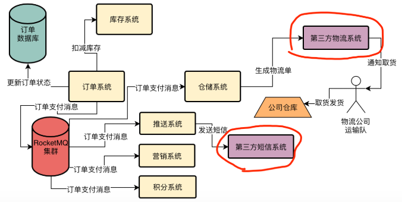
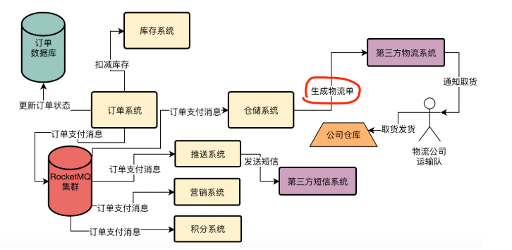
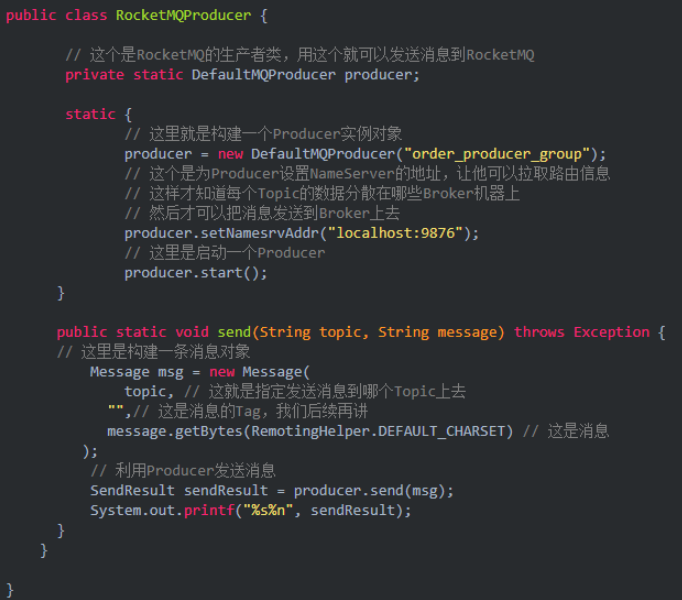
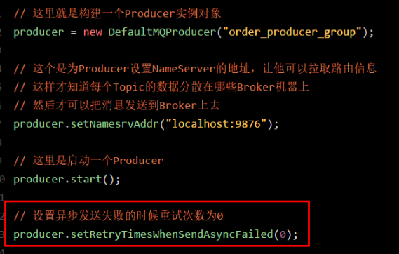
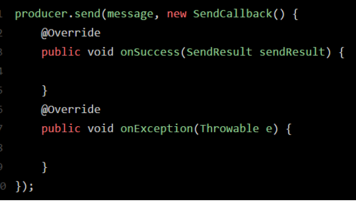
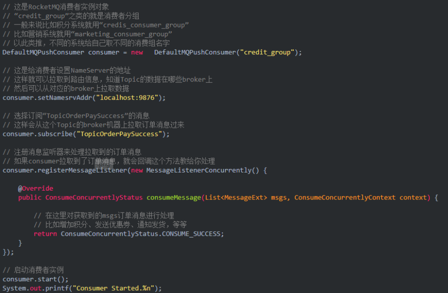
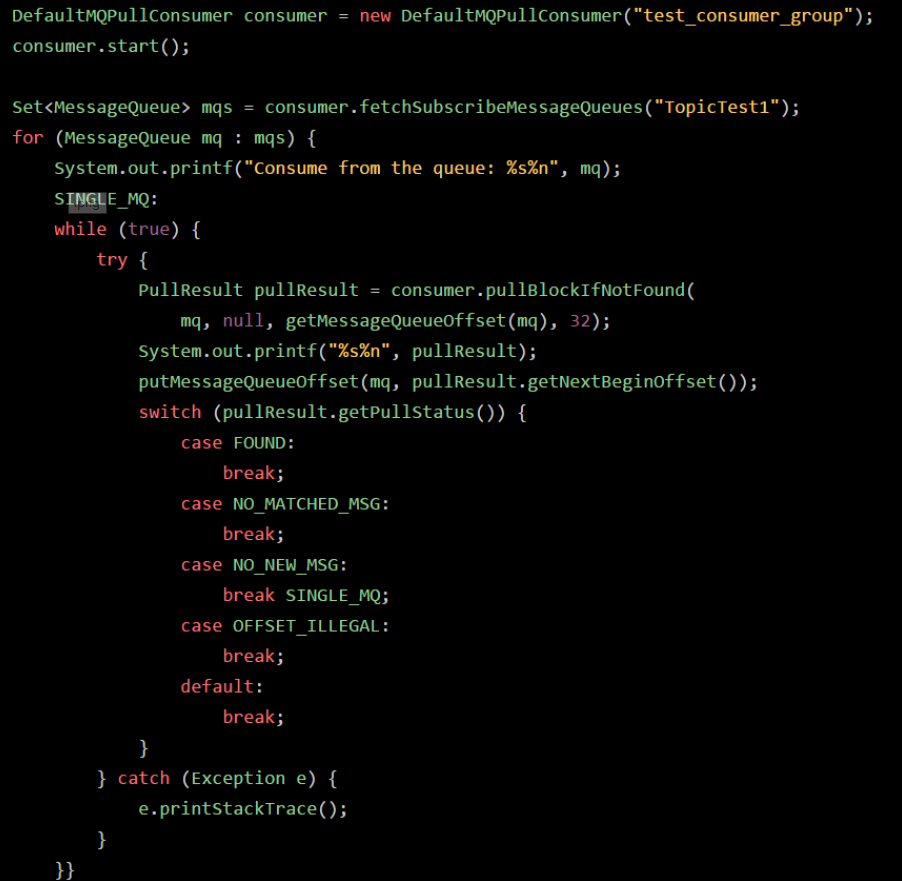

 在推动完成了订单系统的核心流程的异步化改造后，让核心流程的性能一下子提升了10倍以上，从原来需要1秒甚至几秒才能完成，到现在核心流程只需要执行订单状态更新以及库存扣减两个步骤，以及发送一个消息到RocketMQ里去，仅仅需要耗时100ms。 

 那么接着应该解决订单系统哪个问题呢？ 

1. 下单核心流程环节太多，性能较差
2. 订单退款的流程可能面临退款失败的风险
3. 关闭过期订单的时候，存在扫描大量订单数据的问题
4. 跟第三方物流系统耦合在一起，性能存在抖动的风险
5. 大数据团队要获取订单数据，存在不规范直接查询订单数据库的问题
6. 做秒杀活动时订单数据库压力过大

发现在这个订单核心流程图里，可以非常清晰的看到，订单系统间接耦合的第三方系统有两个：

一个是第三方短信系统，是用来推送短信给用户的，一个是第三方物流系统，用生成物流单通知物流公司来收货和配送的。

实际上如果按照以前最早的订单核心流程，订单系统会同步调用推送系统，然后推送系统调用第三方短信系统去发送短信给用户，接着订单系统会同步调用仓储系统，然后仓储系统调用第三方物流系统去生成物流单以及通知发货。

因此在最早的流程中，其实订单系统是间接性的跟第三方短信系统和第三方物流系统耦合在一起的，这样的话，一旦第三方系统出现了性能抖动就会影响到订单系统的性能。

比如正常第三方短信系统发送一个短信，只需要100ms，结果某一天突然性能下降变成发送短信需要1s了，此时会连带导致订单系统的性能也急剧下降。

因为实际上订单系统现在已经不需要直接调用推送系统和仓储系统了，仅仅只是发送一个消息到RocketMQ而已

所以小猛突然灵光一闪发现了一个问题，那就是订单系统跟第三方系统耦合导致性能抖动的问题，其实已经解决了！

因为通过引入MQ到架构里，现在订单系统已经成功的跟推送系统以及仓储系统解耦了，如下面图里的红圈所示。

所以现在订单系统已经跟仓储系统和推送系统没关系了，只不过是仓储系统自己跟第三方物流系统耦合，推送系统自己跟第三方短信系统耦合而已！

此时即使第三方系统出现了严重的性能抖动，甚至是接口故障无法访问，也跟订单系统没任何关系！

因此比如第三方物流系统出现了性能抖动，此时只会影响到仓储系统而已，仓储系统调用第三方物流系统的接口时会出现短暂性的速度较慢的问题，如下图中红圈所示。

所以实际上在订单系统问题列表中的与第三方系统耦合的问题，已经被解决掉了，小猛想到这里，又把下面的第4项给划掉了。

1. 下单核心流程环节太多，性能较差
2. 订单退款的流程可能面临退款失败的风险
3. 关闭过期订单的时候，存在扫描大量订单数据的问题
4. 跟第三方系统耦合在一起，性能存在抖动的风险
5. 大数据团队要获取订单数据，存在不规范直接查询订单数据库的问题
6. 做秒杀活动时订单数据库压力过大

##  什么叫做同步发送消息到RocketMQ？ 

所谓同步，意思就是你通过这行代码发送消息到MQ去，SendResult sendResult = producer.send(msg)，然后你会卡在这里，代码不能往下走了

你要一直等待MQ返回一个结果给你，你拿到了SendResult之后，接着你的代码才会继续往下走。

这个就是所谓的同步发送模式。

什么叫做异步发送消息到RocketMQ?

接着把发送消息的代码改成如下所示：

把消息发送出去，然后上面的代码就直接往下走了，不会卡在这里等待MQ返回结果给你！

然后当MQ返回结果给你的时候，Producer会回调你的SendCallback里的函数，如果发送成功了就回调onSuccess函数，如果发送失败了就回调onExceptino函数。

这个就是所谓的异步发送，异步的意思就是你发送消息的时候不会卡在上面那行代码等待MQ返回结果给你，会继续执行下面的别的代码，当MQ返回结果给你的时候，会回调你的函数！

 **什么叫做发送单向消息到RocketMQ？** 

 还有一种发送消息的方法，叫做发送单向消息，就是用下面的代码来发送消息： 

 这个sendOneway的意思，就是你发送一个消息给MQ，然后代码就往下走了，根本不会关注MQ有没有返回结果给你，你也不需要MQ返回的结果，无论发送的消息是成功还是失败，都不关你的事。 

**什么叫做Push消费模式？**

各个系统从RocketMQ中消费消息的代码片段：

那么什么是Push消费模式呢？

其实很简单，就是Broker会主动把消息发送给你的消费者，你的消费者是被动的接收Broker推送给过来的消息，然后进行处理。

这个就是所谓的Push模式，意思就是Broker主动推送消息给消费者

 **什么叫做Pull消费模式？** 

Broker不会主动推送消息给Consumer，而是消费者主动发送请求到Broker去拉取消息过来。 