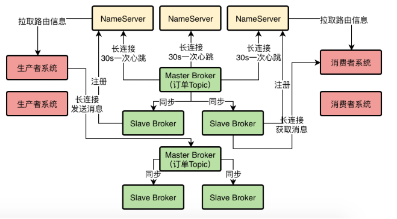
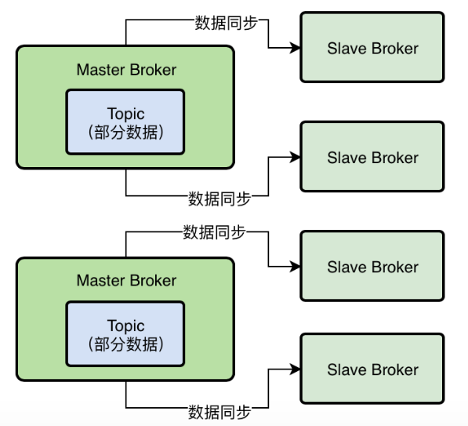
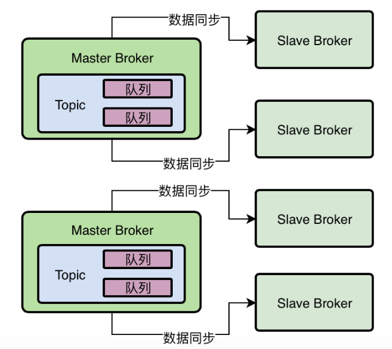
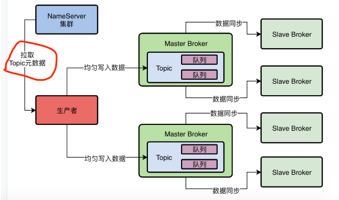
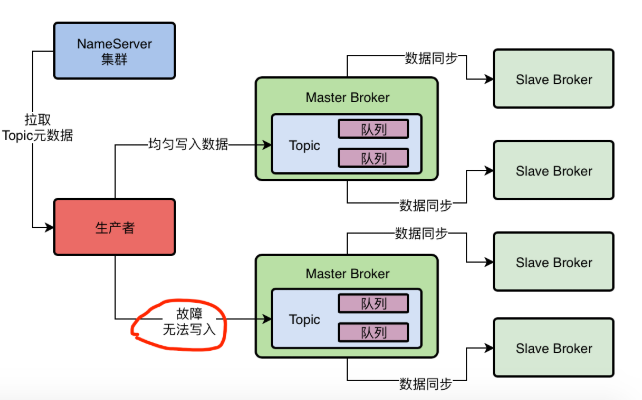

**研究RocketMQ底层原理的顺序和思路**

到底应该采用一个什么样的顺序和思路去研究RocketMQ的底层原理呢？

生产环境部署架构图。

按照如下的思路来研究RocketMQ：

1. 对生产者往Broker集群发送消息的底层原理做一个研究
2. 看看Broker对于接收到的消息，到底是如何存储到磁盘上去的？
3. 基于DLedger技术部署的Broker高可用集群，到底如何进行数据同步的？
4. 消费者到底是基于什么策略选择Master或Slave拉取数据的？
5. 消费者是如何从Broker拉取消息回来，进行处理以及ACK的？如果消费者故障了会如何处理？

**3、创建Topic的时候为何要指定MessageQueue数量？**

要明白MessageQueue是什么，就必须把他跟Topic以及Broker综合起来看，才能搞明白。

如果我们要使用RocketMQ，你先部署出来一套RocketMQ集群这个肯定是必须的，在有了集群之后，就必须根据你的业务需要去创建一些Topic。

比如之前我们看到，我们需要一个“TopicOrderPaySuccess”的Topic去存放订单支付成功的消息。

像这些Topic就可以在之前我们讲过的RocketMQ可视化工作台里去创建，在里面就可以创建一个Topic出来，**在创建Topic的时候需要指定一个很关键的参数，就是MessageQueue**。

简单来说，就是你要指定你的这个Topic对应了多少个队列，也就是多少个MessageQueue。

**4、Topic、MessageQueue以及Broker之间到底是什么关系？**

其实Topic、MessageQueue以及Broker之间是有关系的，咱们来举一个例子

比如你现在有一个Topic，我们为他指定创建了4个MessageQueue，那么我们接着来思考一下，这个Topic的数据在Broker集群中是如何分布的？

之前最早我们给大家讲过，每个Topic的数据都是分布式存储在多个Broker中的，比如下面的图里我们会看到这个示意。

但是我们如何决定这个Topic的哪些数据放这个Broker上，哪些数据放那个Broker上？这是一个问题

所以在这里RocketMQ引入了MessageQueue的概念，本质上就是一个数据分片的机制。

在这个机制中，假设你的Topic有1万条数据，然后你的Topic有4个MessageQueue，那么大致可以认为会在每个MessageQueue中放入2500条数据

当然，这个不是绝对的，有可能有的MessageQueue的数据多，有的数据少，这个要根据你的消息写入MessageQueue的策略来定。

但是我们这里先假定在每个MessageQueue中会平均分配Topic的数据吧，那么下一个问题来了，我们有4个MessageQueue平均分配了Topic的数据，这些MessageQueue放在哪里？

当然是放在Broker上了！

也就是说，很有可能就是在2个Broker上，每个Broker放两个MessageQueue，我们看下面的图就是这个示意。

所以其实MessageQueue就是RocketMQ中非常关键的一个数据分片机制，他通过MessageQueue将一个Topic的数据拆分为了很多个数据分片，然后在每个Broker机器上都存储一些MessageQueue。

通过这个方法，就可以实现Topic数据的分布式存储！

**5、生产者发送消息的时候写入哪个MessageQueue？**

接着我们要考虑一个问题，生产者在发送消息的时候，会写入到哪个MessageQueue中？

要解决这个问题，大家首先就要记得之前我们讲解过的一个重要的点，生产者会跟NameServer进行通信获取Topic的路由数据。

所以生产者从NameServer中就会知道，一个Topic有几个MessageQueue，哪些MessageQueue在哪台Broker机器上，哪些MesssageQueue在另外一台Broker机器上，这些都会知道

我们暂时先认为生产者会均匀的把消息写入各个MessageQueue，就是比如这个生产者发送出去了20条数据，那么4个MessageQueue就是每个都会写入5条数据。

至于其他的写入MessageQueue的策略，我们后续会结合其他的高阶功能和业务场景来讲解，现在大家先不要去纠结这个问题。

通过这个方法，是不是就可以让生产者把写入请求分散给多个Broker？是不是也可以让每个Broker都均匀分摊到一定的写入请求压力？

这样假设单个Broker可以抗每秒7万并发，那么两个Broker就可以抗每秒14万并发！这样就可以实现RocketMQ集群抗下每秒10万+超高并发的场景了！

另外通过这个方法，是不是就可以让一个Topic中的数据分散在多个MessageQueue中，进而分散在多个Broker机器上？这样就可以实现RocketMQ集群分布式存储海量的消息数据了！

**6、如果某个Broker出现故障该怎么办？**

接下来我们分析一下，如果某个Broker临时出现故障了，比如Master Broker挂了，此时正在等待的其他Slave Broker自动热切换为Master Broker，那么这个时候对这一组Broker就没有Master Broker可以写入了

如果你还是按照之前的策略来均匀把数据写入各个Broker上的MessageQueue，那么会导致你在一段时间内，每次访问到这个挂掉的Master Broker都会访问失败，这个似乎不是我们想要的样子。

对于这个问题，通常来说建议大家在Producer中开启一个开关，就是**sendLatencyFaultEnable**

一旦打开了这个开关，那么他会有一个自动容错机制，比如如果某次访问一个Broker发现网络延迟有500ms，然后还无法访问，那么就会自动回避访问这个Broker一段时间，比如接下来3000ms内，就不会访问这个Broker了。

这样的话，就可以避免一个Broker故障之后，短时间内生产者频繁的发送消息到这个故障的Broker上去，出现较多次数的异常。而是在一个Broker故障之后，自动回避一段时间不要访问这个Broker，过段时间再去访问他。

那么这样过一段时间之后，可能这个Master Broker就已经恢复好了，比如他的Slave Broker切换为Master,可以让别人访问了。