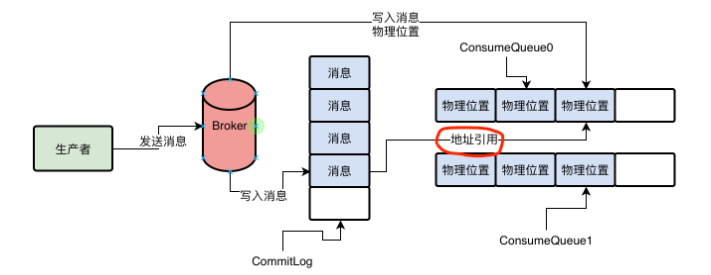

## Broker数据存储机制

Broker数据存储才是一个MQ最核心的环节。决定了生产者消息写入的吞吐量，决定了消息不能丢失，决定了消费者获取消息的吞吐量。

当生产者的消息发送到一个Broker上的时候，broker会把接受的消息直接写入磁盘的日志文件，这个文件叫CommitLog,直接顺序写入这个文件

CommitLog 是很多磁盘文件，每个文件限定最多1GB，Broker收到消息之后就直接追加写入这个文件的末尾。如果一个CommitLog写满了1GB,就会创建一个新的CommitLog文件。

在Borker中，对Topic下的每一个MessageQueue都会有一系列的ConsumeQueue文件。

在Broker的磁盘上，会有下面这种格式的一系列文件

$HOME/store/consumequeue/{topic}/{queueId}/{fileName}

假设有一个Topic，有4个MessageQueue，然后在两台Broker机器上，每台Broker机器会存储两个MessageQueue，那么假设生产者选择对其中一个MessageQueue写入了一条消息，此时消息会发送到Broker上。然后Broker必然会把这个消息写入自己的CommitLog文件中。

当你的Broker收到一条消息写入CommitLog之后，其实他会同时将这条消息在CommitLog中的物理位置，就是一个文件偏移量，就是一个offset，写入到这条消息所属的MessageQueue对应的ConsumeQueue文件中去。

在ConsumeQueue中存储的每条数据不只是消息在CommitLog中的offset偏移量，还包含了消息的长度，以及taghashcode，一条数据是20个字节，每个ConsumeQueue文件保存30万条数据，大概每个文件是5.72MB

## 如何让消息写入CommitLog文件近乎内存写性能的？

